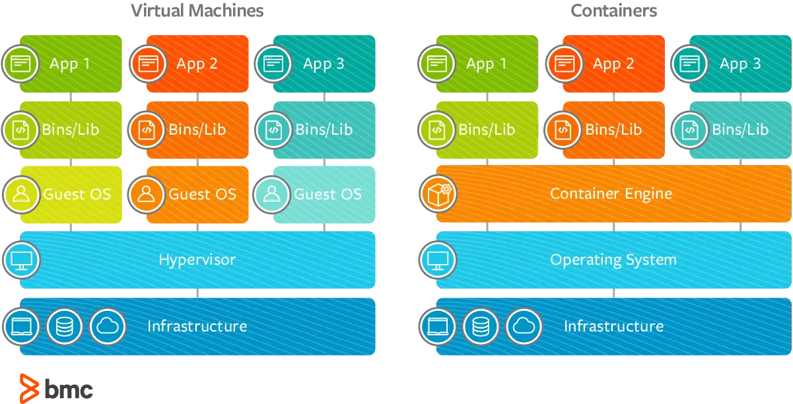
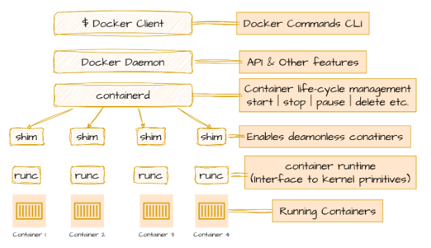
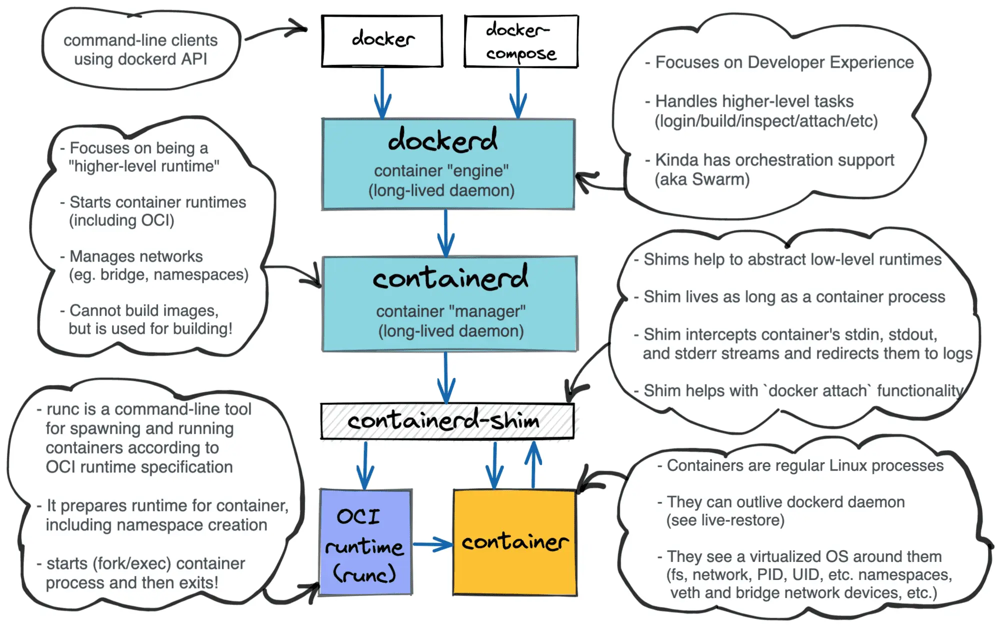
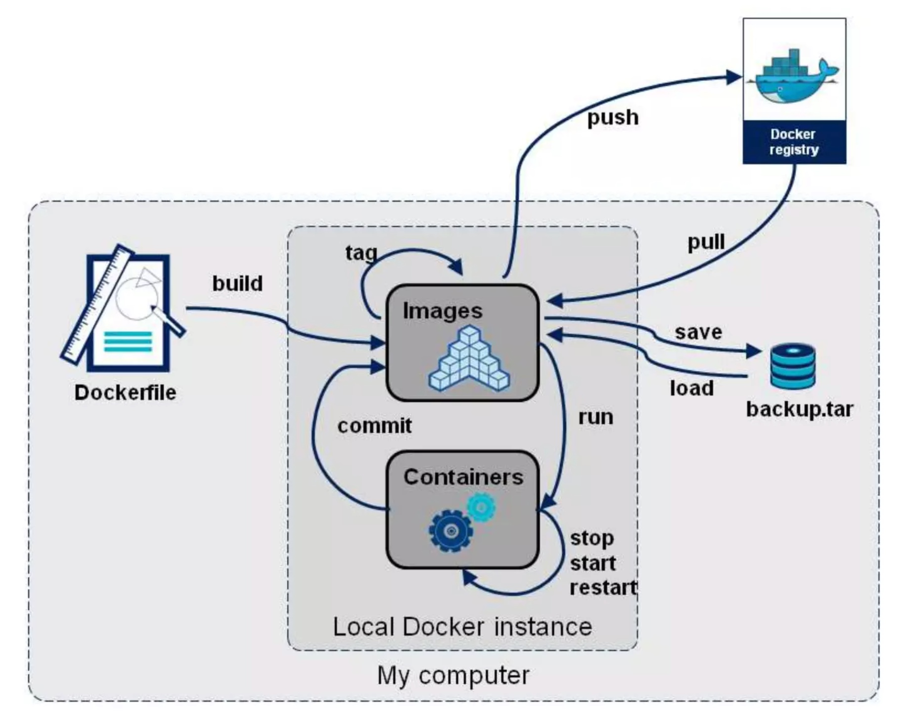
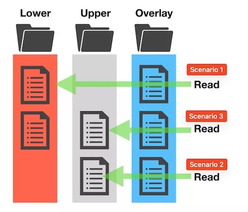
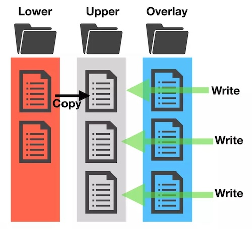
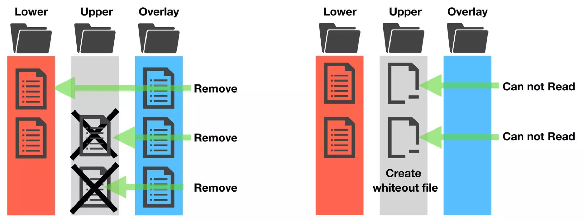
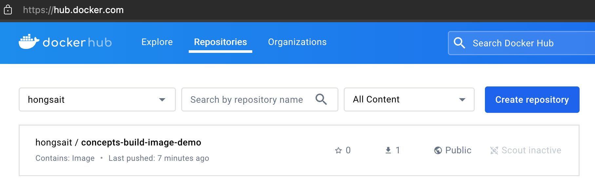

# Container Basics


[How Shipping Containers Revolutionized Global Trade](https://www.linkedin.com/pulse/how-shipping-containers-revolutionized-global-trade-david-conway-ycwyc)


Table of Contents
-----------------

* [Container Basics](#container-basics)
   * [Containers vs Virtual Machines](#containers-vs-virtual-machines)
   * [What Problems Do Containers Solve?](#what-problems-do-containers-solve)
   * [Installing Docker](#installing-docker)
   * [Docker Concepts](#docker-concepts)
      * [What is a container?](#what-is-a-container)
      * [What is an image?](#what-is-an-image)
      * [What is a registry?](#what-is-a-registry)
   * [Docker Engine](#docker-engine)
      * [Under the Hood of docker run](#under-the-hood-of-docker-run)
   * [Essential Docker Commands](#essential-docker-commands)
      * [Review Docker Terms](#review-docker-terms)
      * [Docker CLI Cheat Sheet](#docker-cli-cheat-sheet)
      * [Run Two Containers from the Same Image](#run-two-containers-from-the-same-image)
      * [Docker Lifecycle Commands](#docker-lifecycle-commands)
         * [docker run -d](#docker-run--d)
         * [docker ps -a](#docker-ps--a)
         * [docker start [OPTIONS] CONTAINER](#docker-start-options-container)
         * [docker container attach](#docker-container-attach)
         * [docker container stop](#docker-container-stop)
         * [docker container kill](#docker-container-kill)
         * [docker rm](#docker-rm)
      * [Docker Image Commands](#docker-image-commands)
         * [docker image ls](#docker-image-ls)
         * [docker image rm](#docker-image-rm)
         * [docker image prune](#docker-image-prune)
   * [Building Images](#building-images)
      * [Using docker image commit to create an image](#using-docker-image-commit-to-create-an-image)
      * [Modify UppderDir](#modify-uppderdir)
      * [OverlayFS](#overlayfs)
      * [Writing a Dockerfile](#writing-a-dockerfile)
      * [Build, tag, and publish an image](#build-tag-and-publish-an-image)
         * [Building images](#building-images-1)
         * [Tagging images](#tagging-images)
         * [Publishing images](#publishing-images)
   * [Running Containers](#running-containers)
      * [Publishing Ports](#publishing-ports)
      * [Persisting Container Data](#persisting-container-data)
         * [Container volumes](#container-volumes)
         * [Managing volumes](#managing-volumes)
      * [Sharing local files with containers](#sharing-local-files-with-containers)
         * [Volume versus bind mounts](#volume-versus-bind-mounts)
         * [Sharing files between a host and container](#sharing-files-between-a-host-and-container)
         * [File permissions for Docker access to host files](#file-permissions-for-docker-access-to-host-files)


---


## Containers vs Virtual Machines

 

Credit: [Virtual Machines (VMs) vs Containers: What’s The Difference? – BMC Software | Blogs](https://www.bmc.com/blogs/containers-vs-virtual-machines/)

Read [Containers vs Virtual Machines | Atlassian](https://www.atlassian.com/microservices/cloud-computing/containers-vs-vms)


## What Problems Do Containers Solve?

Excerpt from [How Kubernetes Reinvented Virtual Machines (in a good sense) (iximiuz.com)](https://iximiuz.com/en/posts/kubernetes-vs-virtual-machines/)

> Back in the day, it was pretty common to have **different production and development environments**. That would lead to situations when an app might work locally on your stuffed Debian machine but fail to start on vanilla CentOS in production due to a missing dependency. Conversely, you may have quite some trouble installing the app's dependencies locally, but running a pre-provisioned virtual machine per service for development would be infeasible due to high resource requirements.
>
> The massiveness of virtual machines was a problem even in production. Having a virtual machine per service might lead to **lower than optimal resource utilization** and/or sizable **storage and compute overhead**, but putting multiple services into one box could make them conflict. The **multi-minute startup time** could also use some improvement.
>
> The world obviously needed a more lightweight version of the box.
>
> And that's where The Containers came in. Much like VMs that allowed slicing a bare-metal server into several smaller (and cheaper) machines, containers split a single Linux box into tens or even hundreds of isolated environments.
>
> From within a container, it may feel like you've got a virtual machine of your own, with your favorite Linux distro. Well, at least at first sight. And from the outside, containers were just regular processes running on the host operating system and **sharing its kernel**.
>
> The ability to pack an application with all its dependencies, including a certain version of the OS userland and libraries, ship it as a container image, and run in a standardized execution environment wherever Docker (or alike) is installed **greatly improved the reproducibility of workloads**.
>
> Due to the lightweight implementation of the container boundaries, the computational **overhead got significantly reduced**, allowing a single production server to run tens of different containers potentially belonging to several (micro)services. At the expense of the reduced security, of course.
>
> The image **storage and distribution also became more efficient**, thanks to the immutable and shared image layers.


## Installing Docker

There are plenty of ways and places to get Docker up and running. You can do it on Windows, Mac, or Linux. Whether you want it in the cloud, on-prem, or right on your laptop with VMware Workstation or VirtualBox. 

<details>
  <summary>Play with Docker (PWD)</summary>
https://labs.play-with-docker.com/ is a free 4-hour Docker playground which allows users to run Docker commands in a matter of seconds. It gives the experience of having a free Alpine Linux Virtual Machine in browser, where you can build and run Docker containers and even create clusters.
</details>

<details>
  <summary>Install Docker Engine on Ubuntu</summary>
  https://docs.docker.com/engine/install/ubuntu/ <br>
  https://docs.docker.com/engine/install/linux-postinstall/
</details>

<details>
  <summary>Install Docker Engine on RHEL</summary>
  https://docs.docker.com/engine/install/rhel/ <br>
  https://docs.docker.com/engine/install/linux-postinstall/
</details>

Installing Docker Engine directly on Linux is often better for learners compared to using Docker Desktop for a few reasons:

1. **Simplicity**: Linux simplifies Docker installation and usage because Docker was originally designed for Linux. Learners can avoid the complexities and potential issues associated with running Docker through a virtualization layer.
2. **Command Line Proficiency**: Using Docker Engine on Linux encourages learners to become more comfortable with the command line, which is an essential skill for DevOps and development roles.
3. **Access to Native Linux Features**: Docker on Linux can leverage native kernel features directly, providing a more seamless and integrated experience.
4. **Community and Support**: The Docker community and many tutorials are heavily Linux-focused. Learners using Linux will find it easier to follow along with these resources and seek help when needed.

The demos in this document run on a Ubuntu 24.04 LTS VM.

```
ubuntu@docker-host:~$ lsb_release  -a
No LSB modules are available.
Distributor ID:	Ubuntu
Description:	Ubuntu 24.04 LTS
Release:	24.04
Codename:	noble

ubuntu@docker-host:~$ cat /etc/os-release
PRETTY_NAME="Ubuntu 24.04 LTS"
NAME="Ubuntu"
VERSION_ID="24.04"
VERSION="24.04 LTS (Noble Numbat)"
VERSION_CODENAME=noble
ID=ubuntu
ID_LIKE=debian
HOME_URL="https://www.ubuntu.com/"
SUPPORT_URL="https://help.ubuntu.com/"
BUG_REPORT_URL="https://bugs.launchpad.net/ubuntu/"
PRIVACY_POLICY_URL="https://www.ubuntu.com/legal/terms-and-policies/privacy-policy"
UBUNTU_CODENAME=noble
LOGO=ubuntu-logo
```

```
ubuntu@docker-host:~$ docker info
Client: Docker Engine - Community
 Version:    26.1.4
 Context:    default
 Debug Mode: false
 Plugins:
  buildx: Docker Buildx (Docker Inc.)
    Version:  v0.14.1
    Path:     /usr/libexec/docker/cli-plugins/docker-buildx
  compose: Docker Compose (Docker Inc.)
    Version:  v2.27.1
    Path:     /usr/libexec/docker/cli-plugins/docker-compose
......
```

## Docker Concepts

### What is a container?

Excerpt from https://docs.docker.com/guides/docker-concepts/the-basics/what-is-a-container/:

> Without getting too deep, a VM is an entire operating system with its own kernel, hardware drivers, programs, and applications. Spinning up a VM only to isolate a single application is a lot of overhead. 
> 
> A container is simply an isolated process with all of the files it needs to run. If you run multiple containers, they all share the same kernel, allowing you to run more applications on less infrastructure.

> [!NOTE]  
> **Using VMs and containers together**: Quite often, you will see containers and VMs used together. As an example, in a cloud environment, the provisioned machines are typically VMs. However, instead of provisioning one machine to run one application, a VM with a container runtime can run multiple containerized applications, increasing resource utilization and reducing costs.

Run a container:

```
docker run -d -p 8080:80 docker/welcome-to-docker
```
The output from this command is the full container ID. 
```
Unable to find image 'docker/welcome-to-docker:latest' locally
latest: Pulling from docker/welcome-to-docker
96526aa774ef: Pull complete
740091335c74: Pull complete
da9c2e764c5b: Pull complete
ade17ad21ef4: Pull complete
4e6f462c8a69: Pull complete
1324d9977cd2: Pull complete
1b9b96da2c74: Pull complete
5d329b1e101a: Pull complete
Digest: sha256:eedaff45e3c78538087bdd9dc7afafac7e110061bbdd836af4104b10f10ab693
Status: Downloaded newer image for docker/welcome-to-docker:latest
ea219fee063f826773e85ade36ccd3e4ac654aa4b5de2ed3b42374fe745f8886
```
Run `docker ps` to verify the container ID.
```
ubuntu@docker-host:~$ docker ps
CONTAINER ID   IMAGE                      COMMAND                  CREATED         STATUS         PORTS                  NAMES
ea219fee063f   docker/welcome-to-docker   "/docker-entrypoint.…"   8 seconds ago   Up 8 seconds   0.0.0.0:8080->80/tcp   elated_chatterjee
```
> [!NOTE]  
> `docker run` is an alias of `docker container run`. https://docs.docker.com/reference/cli/docker/container/run/

### What is an image?

Excerpt from https://docs.docker.com/guides/docker-concepts/the-basics/what-is-an-image/:

> A container image is a standardized package that includes all of the files, binaries, libraries, and configurations to run a container.

Excerpt from https://docs.vmware.com/en/VMware-vSphere/8.0/vsphere-vm-administration/GUID-E9EAF7AC-1C08-441A-AB80-0BAA1EAF9F0A.html:

> VM Templates are primary copies of virtual machines that you can use to deploy virtual machines that are customized and ready for use. Templates promote consistency throughout your vSphere environment. You can use the content library to store and manage templates of virtual machines and vApps.


> [!TIP]
> A vSphere VM Template is a stopped VM. A container image is a stopped container.
>
> In VMware vSphere, you can convert or clone a VM into a template. In Docker, you can commit a container to create an OCI container image.


Search for images using the [`docker search`](https://docs.docker.com/reference/cli/docker/search/) command:

```
docker search nginx
```

```
NAME                               DESCRIPTION                                     STARS     OFFICIAL
nginx                              Official build of Nginx.                        19963     [OK]
unit                               Official build of NGINX Unit: Universal Web …   32        [OK]
nginx/nginx-ingress                NGINX and  NGINX Plus Ingress Controllers fo…   92
nginxinc/nginx-unprivileged        Unprivileged NGINX Dockerfiles                  152
nginx/nginx-prometheus-exporter    NGINX Prometheus Exporter for NGINX and NGIN…   42
nginxinc/nginx-s3-gateway          Authenticating and caching gateway based on …   6
nginx/unit                         This repository is retired, use the Docker o…   63
nginx/nginx-ingress-operator       NGINX Ingress Operator for NGINX and NGINX P…   2
nginxinc/amplify-agent             NGINX Amplify Agent docker repository           1
nginx/nginx-quic-qns               NGINX QUIC interop                              1
nginxinc/ingress-demo              Ingress Demo                                    4
nginxproxy/nginx-proxy             Automated nginx proxy for Docker containers …   139
nginxproxy/acme-companion          Automated ACME SSL certificate generation fo…   134
nginx/unit-preview                 Unit preview features                           0
bitnami/nginx                      Bitnami container image for NGINX               189
bitnami/nginx-ingress-controller   Bitnami container image for NGINX Ingress Co…   34
nginxproxy/docker-gen              Generate files from docker container meta-da…   17
bitnami/nginx-exporter             Bitnami container image for NGINX Exporter      5
nginxinc/mra-fakes3                                                                0
ubuntu/nginx                       Nginx, a high-performance reverse proxy & we…   114
nginxinc/ngx-rust-tool                                                             0
nginxinc/mra_python_base                                                           0
rancher/nginx-ingress-controller                                                   13
kasmweb/nginx                      An Nginx image based off nginx:alpine and in…   8
```

Pull an image using the [`docker pull`](https://docs.docker.com/reference/cli/docker/image/pull/) command.

```
docker pull docker/welcome-to-docker
```

You will see output like the following:

```
Using default tag: latest
latest: Pulling from docker/welcome-to-docker
96526aa774ef: Pull complete
740091335c74: Pull complete
da9c2e764c5b: Pull complete
ade17ad21ef4: Pull complete
4e6f462c8a69: Pull complete
1324d9977cd2: Pull complete
1b9b96da2c74: Pull complete
5d329b1e101a: Pull complete
Digest: sha256:eedaff45e3c78538087bdd9dc7afafac7e110061bbdd836af4104b10f10ab693
Status: Downloaded newer image for docker/welcome-to-docker:latest
docker.io/docker/welcome-to-docker:latest
```

> Each of line represents a different downloaded layer of the image. Remember that each layer is a set of filesystem changes and provides functionality of the image.

List your downloaded images using the [`docker image ls`](https://docs.docker.com/reference/cli/docker/image/ls/) or `docker images` command:

```
docker image ls
```

```
REPOSITORY                 TAG       IMAGE ID       CREATED        SIZE
docker/welcome-to-docker   latest    c1f619b6477e   7 months ago   18.6MB
```

List the image's layers using the [`docker image history`](https://docs.docker.com/reference/cli/docker/image/history/) command:

```
docker image history docker/welcome-to-docker
```

```
IMAGE          CREATED        CREATED BY                                      SIZE      COMMENT
c1f619b6477e   7 months ago   COPY /app/build /usr/share/nginx/html # buil…   1.6MB     buildkit.dockerfile.v0
<missing>      8 months ago   /bin/sh -c #(nop)  CMD ["nginx" "-g" "daemon…   0B
<missing>      8 months ago   /bin/sh -c #(nop)  STOPSIGNAL SIGQUIT           0B
<missing>      8 months ago   /bin/sh -c #(nop)  EXPOSE 80                    0B
<missing>      8 months ago   /bin/sh -c #(nop)  ENTRYPOINT ["/docker-entr…   0B
<missing>      8 months ago   /bin/sh -c #(nop) COPY file:9e3b2b63db9f8fc7…   4.62kB
<missing>      8 months ago   /bin/sh -c #(nop) COPY file:57846632accc8975…   3.02kB
<missing>      8 months ago   /bin/sh -c #(nop) COPY file:3b1b9915b7dd898a…   298B
<missing>      8 months ago   /bin/sh -c #(nop) COPY file:caec368f5a54f70a…   2.12kB
<missing>      8 months ago   /bin/sh -c #(nop) COPY file:01e75c6dd0ce317d…   1.62kB
<missing>      8 months ago   /bin/sh -c set -x     && addgroup -g 101 -S …   9.61MB
<missing>      8 months ago   /bin/sh -c #(nop)  ENV PKG_RELEASE=1            0B
<missing>      8 months ago   /bin/sh -c #(nop)  ENV NGINX_VERSION=1.25.3     0B
<missing>      8 months ago   /bin/sh -c #(nop)  LABEL maintainer=NGINX Do…   0B
<missing>      8 months ago   /bin/sh -c #(nop)  CMD ["/bin/sh"]              0B
<missing>      8 months ago   /bin/sh -c #(nop) ADD file:756183bba9c7f4593…   7.34MB
```

This output shows you all of the layers, their sizes, and the command used to create the layer.

### What is a registry?

Excerpt from https://docs.docker.com/guides/docker-concepts/the-basics/what-is-a-registry/:
> An image registry is a centralized location for storing and sharing your container images. It can be either public or private. Docker Hub is a public registry that anyone can use and is the default registry.
> 
> While Docker Hub is a popular option, there are many other available container registries available today, including Amazon Elastic Container Registry(ECR), Azure Container Registry (ACR), and Google Container Registry (GCR). You can even run your private registry on your local system or inside your organization. For example, Harbor, JFrog Artifactory, GitLab Container registry etc.
> 
> While you're working with registries, you might hear the terms registry and repository as if they're interchangeable. Even though they're related, they're not quite the same thing.
> 
> A registry is a centralized location that stores and manages container images, whereas a repository is a collection of related container images within a registry. Think of it as a folder where you organize your images based on projects. Each repository contains one or more container images.

https://docs.docker.com/docker-hub/quickstart/

https://docs.docker.com/docker-hub/repos/

GitHub and DockerHub serve parallel roles in their respective domains: GitHub for managing and sharing code, and DockerHub for managing and sharing container images.

**Code vs. Container Images**: Just as developers push their code to GitHub to share and collaborate, they push their Docker images to DockerHub. Docker images are essentially packages of applications along with their dependencies, making them easy to distribute and run consistently across different environments.

**Version Control**: Both platforms allow versioning. On GitHub, you have commits and branches for different versions of code. On DockerHub, you have tagged versions of container images.

**Community and Collaboration**: GitHub provides a community space for developers to contribute to open-source projects. Similarly, DockerHub enables sharing of container images, fostering collaboration within the community to build and improve containerized applications.

**Ease of Access**: Both platforms provide easy access to their respective resources. Developers can clone a repository from GitHub to get the code they need, just as they can pull an image from DockerHub to get the necessary container.


## Docker Engine

Excerpt from https://docs.docker.com/engine/:

> Docker Engine is an open source containerization technology for building and containerizing your applications. Docker Engine acts as a client-server application with:
>
> - A server with a long-running daemon process [`dockerd`](https://docs.docker.com/reference/cli/dockerd).
> - APIs which specify interfaces that programs can use to talk to and instruct the Docker daemon.
> - A command line interface (CLI) client [`docker`](https://docs.docker.com/reference/cli/docker/).

Excerpt from https://docs.docker.com/guides/docker-overview/#docker-architecture:

> Docker uses a client-server architecture. The Docker client talks to the Docker daemon, which does the heavy lifting of building, running, and distributing your Docker containers. The Docker client and daemon can run on the same system, or you can connect a Docker client to a remote Docker daemon. The Docker client and daemon communicate using a REST API, over UNIX sockets or a network interface. Another Docker client is Docker Compose, that lets you work with applications consisting of a set of containers.


> [!TIP]
> Docker engine runs and manages containers. VMware ESXi runs and manages VMs.

The main components of the Docker engine include the Docker daemon, the build system, containerd, runc, and various plugins like networking and volumes. These elements work together to create and run containers.



Credit: [Docker - Engine | i2tutorials](https://www.i2tutorials.com/docker-tutorial/docker-engine/)

 

Credit: https://iximiuz.com/en/posts/container-learning-path/

### Under the Hood of `docker run`

[UNDERSTANDING DOCKER. 1 — INTRODUCTION : | by B.R.O.L.Y | Medium](https://medium.com/@ridwaneelfilali/docker-explained-86987249ad25)

The following `docker run` command starts a container based on `hello-world` image from DockerHub:

```
docker run hello-world
```

Under the hood:

1. You enter command `docker run hello-world` into the Docker CLI, the Docker client translates them into the appropriate API payload and sends them to the API endpoint provided by the Docker daemon.
2. The daemon receives the command to create a new container, it calls containerd. Keep in mind that the daemon no longer contains any code for creating containers.
3. containerd itself cannot create containers; it relies on runc for that task. It converts the necessary Docker image into an OCI bundle and instructs runc to use this bundle to create a new container.
4. runc interacts with the OS kernel to assemble all the necessary constructs for creating a container, such as namespaces and cgroups. The container process begins as a child process of runc, and once it starts, runc exits.

 

Credit: [Docker Engine Architecture Under the Hood | by Yeldos Balgabekov | Medium](https://medium.com/@yeldos/docker-engine-architecture-under-the-hood-741512b340d5)


## Essential Docker Commands


Credit: https://www.slideshare.net/slideshow/docker-41045742/41045742

### Review Docker Terms

- **Image**: A container image is a read-only package that includes everything needed to run an application. This includes the application code, dependencies, a minimal set of OS constructs, and metadata. One image can be used to start multiple containers.
> [!NOTE]  
> Image, Docker image, container image, and OCI image are interchangeable terms.
- **Container**: A container is simply an isolated process with all of the files it needs to run. If you run multiple containers, they all share the same kernel, allowing you to run more applications on less infrastructure.
- **Registry**: An image registry is a centralized location for storing and sharing your container images. It can be either public or private. Docker Hub is a public registry that anyone can use and is the default registry.

### Docker CLI Cheat Sheet

[Official Get Started Docker CLI Cheat Sheet](https://docs.docker.com/get-started/docker_cheatsheet.pdf)

[The Ultimate Docker Cheat Sheet | dockerlabs (collabnix.com)](https://dockerlabs.collabnix.com/docker/cheatsheet/)

### Run Two Containers from the Same Image

Start an Alpine Linux container:

```shell
# This command runs on the host
docker run -it alpine
```

Excerpt from [docker run | Docker Docs](https://docs.docker.com/reference/cli/docker/container/run/):

> The `docker run` command runs a command in a new container, pulling the image if needed and starting the container. `-it` options open a shell inside a running container.
>
> Option:
>
> - `-i` or `--interactive`: Keep STDIN open even if not attached
> - `-t` or `--tty`: Allocate a pseudo-TTY

You will see output like the following:

```
Unable to find image 'alpine:latest' locally
latest: Pulling from library/alpine
ec99f8b99825: Pull complete
Digest: sha256:b89d9c93e9ed3597455c90a0b88a8bbb5cb7188438f70953fede212a0c4394e0
Status: Downloaded newer image for alpine:latest
/ #
```

Check the OS information inside the running container:
```
# This command runs inside the container
/ # cat /etc/os-release
NAME="Alpine Linux"
ID=alpine
VERSION_ID=3.20.1
PRETTY_NAME="Alpine Linux v3.20"
HOME_URL="https://alpinelinux.org/"
BUG_REPORT_URL="https://gitlab.alpinelinux.org/alpine/aports/-/issues"
```

Use `ps aux` to list all processes running inside the container:

```
# This command runs inside the container
/ # ps aux
PID   USER     TIME  COMMAND
    1 root      0:00 /bin/sh
    8 root      0:00 ps aux
```

On the host, run `docker container ls` to list containers:

```
# This command runs on the host
docker container ls
CONTAINER ID   IMAGE     COMMAND     CREATED          STATUS          PORTS     NAMES
6c272c60442b   alpine    "/bin/sh"   19 minutes ago   Up 19 minutes             crazy_faraday
```
> [!NOTE]  
> `crazy_faraday` is the random container name generated by Docker if no container name is specified in the `docker run` command. [moby/pkg/namesgenerator/names-generator.go at master · moby/moby (github.com)](https://github.com/moby/moby/blob/master/pkg/namesgenerator/names-generator.go)
>
> `docker container ls` has many aliases: `docker container list` `docker container ps` and `docker ps`. `docker ps` is the most popular one. [docker ps | Docker Docs](https://docs.docker.com/reference/cli/docker/container/ls/)


Start another Alpine Linux container using the identical `docker run` command:

```shell
# This command runs on the host
docker run -it alpine
```

On the host, run `docker ps` to list containers:

```
# This command runs on the host
docker ps
CONTAINER ID   IMAGE     COMMAND     CREATED          STATUS          PORTS     NAMES
5db5a74490d5   alpine    "/bin/sh"   7 seconds ago    Up 6 seconds              reverent_sutherland
6c272c60442b   alpine    "/bin/sh"   26 minutes ago   Up 26 minutes             crazy_faraday
```

Create a new file inside `crazy_faraday` container:

```
# These commands run inside the crazy_faraday container
/ # touch /a-new-file.txt
/ # ls /
a-new-file.txt  etc             media           proc            sbin            tmp
bin             home            mnt             root            srv             usr
dev             lib             opt             run             sys             var
```

List the files inside `reverent_sutherland` container:

```
# This command runs inside the reverent_sutherland container
/ # ls /
bin    etc    lib    mnt    proc   run    srv    tmp    var
dev    home   media  opt    root   sbin   sys    usr
```

It's evident that the two containers created from the same image have isolated storage. The `a-new-file.txt` file exists inside `crazy_faraday` container only.

Run `uname -a` on both containers and the host:

```
# This command runs inside the crazy_faraday container
/ # uname -a
Linux 5361e28bfc38 6.8.0-35-generic #35-Ubuntu SMP PREEMPT_DYNAMIC Mon May 20 15:51:52 UTC 2024 x86_64 Linux
```

```
# This command runs inside the reverent_sutherland container
/ # uname -a
Linux 1d9204993126 6.8.0-35-generic #35-Ubuntu SMP PREEMPT_DYNAMIC Mon May 20 15:51:52 UTC 2024 x86_64 Linux
```

```
# This command runs on the host
ubuntu@docker-host:~$ uname -a
Linux docker-host 6.8.0-35-generic #35-Ubuntu SMP PREEMPT_DYNAMIC Mon May 20 15:51:52 UTC 2024 x86_64 x86_64 x86_64 GNU/Linux
```

This demo proves that if you run multiple containers, they all share the same kernel, allowing you to run more applications on less infrastructure.

Run `ps aux | grep '/bin/sh'` on the host to list container processes:

```
# This command runs on the host
ubuntu@docker-host:~$ ps aux | grep '/bin/sh'
root        2611  0.0  0.0   1724  1024 pts/0    Ss+  00:47   0:00 /bin/sh
root        3063  0.0  0.0   1724  1024 pts/0    Ss+  01:14   0:00 /bin/sh
ubuntu      3141  0.0  0.0   6544  2304 pts/2    S+   01:25   0:00 grep --color=auto /bin/sh
```

Run `exit` inside the `reverent_sutherland` container then run `docker ps` on the host:

```
# This command runs on the host
ubuntu@docker-host:~$ docker ps
CONTAINER ID   IMAGE     COMMAND     CREATED          STATUS          PORTS     NAMES
6c272c60442b   alpine    "/bin/sh"   40 minutes ago   Up 40 minutes             crazy_faraday
```

Run `ps aux | grep '/bin/sh'` on the host again to list container processes:

```
# This command runs on the host
ubuntu@docker-host:~$ ps aux | grep '/bin/sh'
root        2611  0.0  0.0   1724  1024 pts/0    Ss+  00:47   0:00 /bin/sh
ubuntu      3200  0.0  0.0   6544  2304 pts/2    S+   01:29   0:00 grep --color=auto /bin/sh
```

Run `sudo kill -9 2611` on the host to kill the `/bin/sh` process then run `docker ps` on the host:

```
# These commands run on the host
ubuntu@docker-host:~$ sudo kill -9 2611
ubuntu@docker-host:~$ ps aux | grep '/bin/sh'
ubuntu      3257  0.0  0.0   6544  2304 pts/2    S+   01:30   0:00 grep --color=auto /bin/sh
ubuntu@docker-host:~$ docker ps
CONTAINER ID   IMAGE     COMMAND   CREATED   STATUS    PORTS     NAMES
```

This demo proves that a container is simply an isolated process with all of the files it needs to run.

### Docker Lifecycle Commands

List of `docker container` commands: [docker container | Docker Docs](https://docs.docker.com/reference/cli/docker/container/)

#### `docker run -d`

Run container in background and print container ID.

#### `docker ps -a`

Show all containers (default shows just running).

```
# This command runs on the host
ubuntu@docker-host:~$ docker ps -a
CONTAINER ID   IMAGE         COMMAND     CREATED             STATUS                         PORTS     NAMES
5db5a74490d5   alpine        "/bin/sh"   25 minutes ago      Exited (0) 11 minutes ago                reverent_sutherland
6c272c60442b   alpine        "/bin/sh"   51 minutes ago      Exited (137) 9 minutes ago               crazy_faraday
b0a454d2a766   hello-world   "/hello"    About an hour ago   Exited (0) About an hour ago             charming_blackwell
```

#### `docker start [OPTIONS] CONTAINER`

Start one or more stopped containers.

```
# This command runs on the host
ubuntu@docker-host:~$ docker container start 5db5a74490d5
5db5a74490d5
ubuntu@docker-host:~$ docker ps
CONTAINER ID   IMAGE     COMMAND     CREATED          STATUS         PORTS     NAMES
5db5a74490d5   alpine    "/bin/sh"   26 minutes ago   Up 1 second              reverent_sutherland
```

#### `docker container attach`

Attach local standard input, output, and error streams to a running container.

```
# This command runs on the host
ubuntu@docker-host:~$ docker attach 5db5a74490d5
/ #
```

> [!NOTE]  
> `docker attach` is an alias of `docker container attach`. 

#### `docker container stop`

Stop one or more running containers. The main process inside the container will receive `SIGTERM`, and after a grace period, `SIGKILL`.

```
# This command runs on the host
ubuntu@docker-host:~$ docker stop 5db5a74490d5
5db5a74490d5
```

> [!NOTE]  
> `docker stop` is an alias of `docker container stop`. 

Observe the time it takes to stop a container.

#### `docker container kill`

Kill one or more running containers. The main process inside the container is sent `SIGKILL` signal (default), or the signal that is specified with the `--signal` option.

```
# This command runs on the host
ubuntu@docker-host:~$ docker kill 5db5a74490d5
5db5a74490d5
```

> [!NOTE]  
> `docker kill` is an alias of `docker container kill`. 

Observe the time it takes to kill a container.

#### `docker stop` vs. `docker kill`

Using `docker stop` provides a more graceful way to halt a container, allowing the main process to perform cleanup tasks before terminating. In contrast, the `docker kill` command forcefully stops the container immediately, without waiting for any cleanup. The decision between using `docker stop` and `docker kill` depends on whether you want to allow the processes inside the container time to clean up before termination.

[Difference Between docker stop and docker kill Commands | Baeldung on Ops](https://www.baeldung.com/ops/docker-stop-vs-kill)

#### `docker rm`

Remove one or more containers.

```
# These commands run on the host

# Before docker rm
ubuntu@docker-host:~$ docker ps -a
CONTAINER ID   IMAGE         COMMAND     CREATED             STATUS                        PORTS     NAMES
5db5a74490d5   alpine        "/bin/sh"   37 minutes ago      Exited (137) 2 minutes ago              reverent_sutherland
6c272c60442b   alpine        "/bin/sh"   About an hour ago   Exited (137) 21 minutes ago             crazy_faraday
b0a454d2a766   hello-world   "/hello"    2 hours ago         Exited (0) 8 minutes ago                charming_blackwell

ubuntu@docker-host:~$ docker rm 5db5a74490d5
5db5a74490d5

# After docker rm
ubuntu@docker-host:~$ docker ps -a
CONTAINER ID   IMAGE         COMMAND     CREATED             STATUS                        PORTS     NAMES
6c272c60442b   alpine        "/bin/sh"   About an hour ago   Exited (137) 21 minutes ago             crazy_faraday
b0a454d2a766   hello-world   "/hello"    2 hours ago         Exited (0) 8 minutes ago                charming_blackwell
```

### Docker Image Commands

#### `docker image ls`

List images.

```
# This command runs on the host
ubuntu@docker-host:~$ docker images
REPOSITORY                 TAG       IMAGE ID       CREATED         SIZE
alpine                     latest    a606584aa9aa   3 days ago      7.8MB
docker/welcome-to-docker   latest    c1f619b6477e   7 months ago    18.6MB
hello-world                latest    d2c94e258dcb   13 months ago   13.3kB
```

> [!NOTE]  
> `docker images` is an alias of `docker image ls`. 

#### `docker image rm`

Remove one or more images. Removes (and un-tags) one or more images from the host node. If an image has multiple tags, using this command with the tag as a parameter only removes the tag. If the tag is the only one for the image, both the image and the tag are removed.

```
# These commands run on the host

ubuntu@docker-host:~$ docker ps -a
CONTAINER ID   IMAGE         COMMAND     CREATED             STATUS                      PORTS     NAMES
6c272c60442b   alpine        "/bin/sh"   About an hour ago   Up 7 minutes                          crazy_faraday
b0a454d2a766   hello-world   "/hello"    2 hours ago         Exited (0) 17 minutes ago             charming_blackwell

ubuntu@docker-host:~$ docker rm b0a454d2a766
b0a454d2a766

ubuntu@docker-host:~$ docker rmi hello-world
Untagged: hello-world:latest
Untagged: hello-world@sha256:94323f3e5e09a8b9515d74337010375a456c909543e1ff1538f5116d38ab3989
Deleted: sha256:d2c94e258dcb3c5ac2798d32e1249e42ef01cba4841c2234249495f87264ac5a
Deleted: sha256:ac28800ec8bb38d5c35b49d45a6ac4777544941199075dff8c4eb63e093aa81e
```

This does not remove images from a registry. You cannot remove an image of a running container unless you use the `-f` option. 

```
# This command runs on the host
ubuntu@docker-host:~$ docker rmi alpine:latest
Error response from daemon: conflict: unable to remove repository reference "alpine:latest" (must force) - container 6c272c60442b is using its referenced image a606584aa9aa
```

> [!NOTE]  
> `docker rmi` is an alias of `docker image rm`. 

#### `docker image prune`

Remove all dangling images. If `-a` is specified, also remove all images not referenced by any container.

```
# These commands run on the host

ubuntu@docker-host:~$ docker images
REPOSITORY                 TAG       IMAGE ID       CREATED        SIZE
alpine                     latest    a606584aa9aa   3 days ago     7.8MB
docker/welcome-to-docker   latest    c1f619b6477e   7 months ago   18.6MB

ubuntu@docker-host:~$ docker ps -a
CONTAINER ID   IMAGE     COMMAND   CREATED   STATUS    PORTS     NAMES

ubuntu@docker-host:~$ docker image prune -a
WARNING! This will remove all images without at least one container associated to them.
Are you sure you want to continue? [y/N] y
Deleted Images:
untagged: alpine:latest
untagged: alpine@sha256:b89d9c93e9ed3597455c90a0b88a8bbb5cb7188438f70953fede212a0c4394e0
deleted: sha256:a606584aa9aa875552092ec9e1d62cb98d486f51f389609914039aabd9414687
deleted: sha256:94e5f06ff8e3d4441dc3cd8b090ff38dc911bfa8ebdb0dc28395bc98f82f983f
untagged: docker/welcome-to-docker:latest
untagged: docker/welcome-to-docker@sha256:eedaff45e3c78538087bdd9dc7afafac7e110061bbdd836af4104b10f10ab693
deleted: sha256:c1f619b6477e36a0b6a2531a972e918ef32bbf0217ee9b536409361261db6df0
deleted: sha256:503c5cd6e10d87f52ccbcbe0fee9b033c6df11dee055c636caa64f65227d02cc
deleted: sha256:12369c7fe5ffb31bc592a24c0cd081c85f34702da4b747ede00543e6f7f54a74
deleted: sha256:2b3208f4feef2df0b1c11744e87d2a5c41a1ef41a1217f7d90f1e7c1dab2ee30
deleted: sha256:97912e57274d7772d7f052fe2d671c5e0ac193863e9d5d02d2575949c17e1cd0
deleted: sha256:8d49f96bd3dac9f64c8b46bda71c268caa7eafb1d9fde95b93a36133a1e805fc
deleted: sha256:2765f389f779d9903825e36b704119da1da13faa4e73a44478fd86f577f4b738
deleted: sha256:baeb76f1ff72a2a650534f62c17308491c058905a82289971c604dea72fe54ed
deleted: sha256:cc2447e1835a40530975ab80bb1f872fbab0f2a0faecf2ab16fbbb89b3589438

Total reclaimed space: 26.35MB
```


## Building Images

[Understanding the image layers | Docker Docs](https://docs.docker.com/guides/docker-concepts/building-images/understanding-image-layers/)

### Using `docker image commit` to create an image

Start a new Ubuntu container:

```
# This command runs on the host
docker run --name=base-container -it ubuntu
```

You will see output like the following:

```
Unable to find image 'ubuntu:latest' locally
latest: Pulling from library/ubuntu
9c704ecd0c69: Pull complete
Digest: sha256:2e863c44b718727c860746568e1d54afd13b2fa71b160f5cd9058fc436217b30
Status: Downloaded newer image for ubuntu:latest
root@64cda439432b:/#
```

Create a `/a.txt` file inside the container:

```
# This command runs inside the container
root@64cda439432b:/# echo 'a' > /a.txt
root@64cda439432b:/# cat /a.txt
a
```

Open a new SSH session to log into the host. Use `docker container commit` command to save the changes you’ve made as a new image layer, from which you can start new containers or build new images.

```
# This command runs on the host
docker container commit -m "Add a.txt" base-container ubuntu-a 
```

[docker container commit | Docker Docs](https://docs.docker.com/reference/cli/docker/container/commit/)

> [!NOTE]  
> `docker commit` is an alias of `docker container commit`. 

Run `docker images` to verify that the new ubuntu-a image has been created:

```
# This command runs on the host
docker images
REPOSITORY   TAG       IMAGE ID       CREATED         SIZE
ubuntu-a     latest    01339e77b0ed   3 seconds ago   78.1MB
ubuntu       latest    35a88802559d   2 weeks ago     78.1MB
```

View the layers of your image using the `docker image history` command:

```
# This command runs on the host
docker image history ubuntu-a
IMAGE          CREATED         CREATED BY                                      SIZE      COMMENT
01339e77b0ed   2 minutes ago   /bin/bash                                       2B        Add a.txt
35a88802559d   2 weeks ago     /bin/sh -c #(nop)  CMD ["/bin/bash"]            0B
<missing>      2 weeks ago     /bin/sh -c #(nop) ADD file:5601f441718b0d192…   78.1MB
<missing>      2 weeks ago     /bin/sh -c #(nop)  LABEL org.opencontainers.…   0B
<missing>      2 weeks ago     /bin/sh -c #(nop)  LABEL org.opencontainers.…   0B
<missing>      2 weeks ago     /bin/sh -c #(nop)  ARG LAUNCHPAD_BUILD_ARCH     0B
<missing>      2 weeks ago     /bin/sh -c #(nop)  ARG RELEASE                  0B
```

The top line `01339e77b0ed   2 minutes ago   /bin/bash   2B ` indicates the new file has been added to the image.

Run `docker image inspect` to display detailed information on one or more images.

```
# These commands run on the host

ubuntu@docker-host:~$ docker image inspect --format='{{json .RootFS}}' ubuntu-a | jq
{
  "Type": "layers",
  "Layers": [
    "sha256:a30a5965a4f7d9d5ff76a46eb8939f58e95be844de1ac4a4b452d5d31158fdea",
    "sha256:36e04ef6d51b6da610c536d339c852b0d658bdc336875354d161060f5d451e6c"
  ]
}

ubuntu@docker-host:~$ docker image inspect --format='{{json .RootFS}}' ubuntu | jq
{
  "Type": "layers",
  "Layers": [
    "sha256:a30a5965a4f7d9d5ff76a46eb8939f58e95be844de1ac4a4b452d5d31158fdea"
  ]
}
```
> [!TIP]  
> `jq`, a command-line JSON processing tool, is a good solution for dealing with machine-readable data formats and is especially useful in shell scripts.
>
>
> https://jqlang.github.io/jq/
>
> https://www.digitalocean.com/community/tutorials/how-to-transform-json-data-with-jq

To prove your new image has the `/a.txt` file, you can start a new container using this new image:

```
# This command runs on the host
docker run ubuntu-a cat /a.txt
a
```
> [!NOTE]  
> A base image is a foundation for building other images. It's possible to use any images as a base image. However, some images are intentionally created as building blocks, providing a foundation or starting point for an application.

### Modify `UppderDir`

Run `docker image inspect` to display the `upper` directory that contains the contents of the container's read-write layer:

```
# This command runs on the host
ubuntu@docker-host:~$ docker image inspect --format='{{json .GraphDriver}}' ubuntu-a | jq
{
  "Data": {
    "LowerDir": "/var/lib/docker/overlay2/de66dfd62099295d42d6068fc48ad6eb88984b90a30da22d17574fb030885f39/diff",
    "MergedDir": "/var/lib/docker/overlay2/022cf4819e93069dced25d93a620e7e78ae8188134782f1b2c13fa16fdecfaef/merged",
    "UpperDir": "/var/lib/docker/overlay2/022cf4819e93069dced25d93a620e7e78ae8188134782f1b2c13fa16fdecfaef/diff",
    "WorkDir": "/var/lib/docker/overlay2/022cf4819e93069dced25d93a620e7e78ae8188134782f1b2c13fa16fdecfaef/work"
  },
  "Name": "overlay2"
}
```

Modify the `a.txt` file on the host:

```
# These commands run on the host

ubuntu@docker-host:~$ sudo cat /var/lib/docker/overlay2/022cf4819e93069dced25d93a620e7e78ae8188134782f1b2c13fa16fdecfaef/diff/a.txt
a

# Add a new line 'b' to a.txt file
ubuntu@docker-host:~$ echo 'b' | sudo tee -a /var/lib/docker/overlay2/022cf4819e93069dced25d93a620e7e78ae8188134782f1b2c13fa16fdecfaef/diff/a.txt
```

Start a new container from image `ubuntu-a` and display the content of `/a.txt` file:

```
# This command runs on the host
ubuntu@docker-host:~$ docker run ubuntu-a cat /a.txt
a
b
```

Start a new container from image `ubuntu-a`  and open the shell.

```
# This command runs on the host
ubuntu@docker-host:~$ docker run -it ubuntu-a
root@aa06e9ee4348:/#
```

Modify the `/a.txt` file inside the container.

```
# These commands run inside the container
root@aa06e9ee4348:/# cat /a.txt
a
b
root@aa06e9ee4348:/# echo 'c' >> /a.txt
root@aa06e9ee4348:/# cat /a.txt
a
b
c
```

Don't exit the container. Verify the content of `a.txt` on the host.

```
# This command runs on the host
ubuntu@docker-host:~$ sudo cat /var/lib/docker/overlay2/022cf4819e93069dced25d93a620e7e78ae8188134782f1b2c13fa16fdecfaef/diff/a.txt
a
b
```

### OverlayFS

[OverlayFS and Docker. This article is some kind of a next… | by Charles Vissol | DevOps.dev](https://blog.devops.dev/overlayfs-and-docker-3dca51c033c4)

Excerpt from [Use the OverlayFS storage driver | Docker Docs](https://docs.docker.com/storage/storagedriver/overlayfs-driver/)

> OverlayFS layers two directories on a single Linux host and presents them as a single directory. These directories are called layers, and the unification process is referred to as a union mount. OverlayFS refers to the lower directory as `lowerdir` and the upper directory a `upperdir`. The unified view is exposed through its own directory called `merged`.
>
> The `overlay2` driver natively supports up to 128 lower OverlayFS layers. This capability provides better performance for layer-related Docker commands such as `docker build` and `docker commit`, and consumes fewer inodes on the backing filesystem.
>
> The following diagram shows how a Docker image and a Docker container are layered. The image layer is the `lowerdir` and the container layer is the `upperdir`. If the image has multiple layers, multiple `lowerdir` directories are used. The unified view is exposed through a directory called `merged` which is effectively the containers mount point.
>
> 
>
> Where the image layer and the container layer contain the same files, the container layer (`upperdir`) takes precedence and obscures the existence of the same files in the image layer.
>
> To create a container, the `overlay2` driver combines the directory representing the image's top layer plus a new directory for the container. The image's layers are the `lowerdirs` in the overlay and are read-only. The new directory for the container is the `upperdir` and is writable.

OverlayFS is an implementation of [Union File System](https://en.wikipedia.org/wiki/UnionFS). It stacks multiple Directory/Files to construct one directory tree.

Container read scenarios:

1. If a container opens a file for read access and the file does not already exist in the container (`upperdir`) it is read from the image (`lowerdir`).
2. If a container opens a file for read access and the file exists in the container (`upperdir`) and not in the image (`lowerdir`), it's read directly from the container.
3. If a container opens a file for read access and the file exists in the image layer and the container layer, the file's version in the container layer is read. Files in the container layer (`upperdir`) obscure files with the same name in the image layer (`lowerdir`).

 

Container write scenarios:

1. The first time a container writes to an existing file, that file does not exist in the container (`upperdir`). The `overlay2` driver performs a `copy_up` operation to copy the file from the image (`lowerdir`) to the container (`upperdir`). The container then writes the changes to the new copy of the file in the container layer.
     

2. Deleting files and directories

   - When a *file* is deleted within a container, a *whiteout* file is created in the container (`upperdir`). The version of the file in the image layer (`lowerdir`) is not deleted (because the `lowerdir` is read-only). However, the whiteout file prevents it from being available to the container.
   - When a *directory* is deleted within a container, an *opaque directory* is created within the container (`upperdir`). This works in the same way as a whiteout file and effectively prevents the directory from being accessed, even though it still exists in the image (`lowerdir`).

    

3. Calling `rename(2)` for a directory is allowed only when both the source and the destination path are on the top layer.

### Writing a Dockerfile

Excerpt from [Writing a Dockerfile | Docker Docs](https://docs.docker.com/guides/docker-concepts/building-images/writing-a-dockerfile/)

> A Dockerfile is a text-based document that's used to create a container image. It provides instructions to the image builder on the commands to run, files to copy, startup command, and more.
>
> A Dockerfile typically follows these steps:
>
> 1. Determine your base image
> 2. Install application dependencies
> 3. Copy in any relevant source code and/or binaries
> 4. Configure the final image

Follow the instructions https://docs.docker.com/guides/docker-concepts/building-images/writing-a-dockerfile/#try-it-out to create a container image using Dockerfile.

1. [Download this ZIP file](https://github.com/docker/getting-started-todo-app/raw/build-image-from-scratch/app.zip) and extract the contents into a directory on your machine.

   ```
   # These commands run on the host
   
   ubuntu@docker-host:~$ cd ~ && wget https://github.com/docker/getting-started-todo-app/raw/build-image-from-scratch/app.zip
   ......
   
   ubuntu@docker-host:~$ sudo apt install unzip -y
   ......
   
   ubuntu@docker-host:~$ unzip app.zip
   ......
   ```

2. Show the content of Dockerfile:
   ```
   # This command runs on the host
   ubuntu@docker-host:~$ cat ./app/Dockerfile
   ```

   ```
   FROM node:20-alpine
   WORKDIR /app
   COPY . .
   RUN yarn install --production
   CMD ["node", "src/index.js"]
   ```

3. Dockerfile breakdown:

   - Define your base image by adding the following line:
     ```
     FROM node:20-alpine
     ```

   - Define the working directory by using the `WORKDIR` instruction. This will specify where future commands will run and the directory files will be copied inside the container image.
     ```
     WORKDIR /usr/local/app
     ```

   - Copy all of the files from your project on your machine into the container image by using the `COPY` instruction:
     ```
     COPY . .
     ```

   - Install the app's dependencies by using the `yarn` CLI and package manager. To do so, run a command using the `RUN` instruction:
     ```
     RUN yarn install --production
     ```

   - Finally, specify the default command to run by using the `CMD` instruction:
     ```
     CMD ["node", "./src/index.js"]
     ```

### Build, tag, and publish an image

Excerpt from [Build, tag, and publish an image | Docker Docs](https://docs.docker.com/guides/docker-concepts/building-images/build-tag-and-publish-an-image/)

> - Building images - the process of building an image based on a `Dockerfile`
> - Tagging images - the process of giving an image a name, which also determines where the image can be distributed
> - Publishing images - the process to distribute or share the newly created image using a container registry

#### Building images

The most basic `docker build` command might look like the following:

```bash
# These commands run on the host
ubuntu@docker-host:~$ cd ~/app
ubuntu@docker-host:~/app$ docker build .
```

The final `.` in the command provides the path or URL to the [build context](https://docs.docker.com/build/building/context/#what-is-a-build-context). At this location, the builder will find the `Dockerfile` and other referenced files.

When you run a build, the builder pulls the base image, if needed, and then runs the instructions specified in the Dockerfile.

With the previous command, the image will have no name, but the output will provide the ID of the image. As an example, the previous command might produce the following output:

```
[+] Building 18.9s (9/9) FINISHED                                                                                                           docker:default
 => [internal] load build definition from Dockerfile                                                                                                  0.0s
 => => transferring dockerfile: 138B                                                                                                                  0.0s
 => [internal] load metadata for docker.io/library/node:20-alpine                                                                                     1.1s
 => [internal] load .dockerignore                                                                                                                     0.0s
 => => transferring context: 2B                                                                                                                       0.0s
 => [1/4] FROM docker.io/library/node:20-alpine@sha256:804aa6a6476a7e2a5df8db28804aa6c1c97904eefb01deed5d6af24bb51d0c81                               3.0s
 => => resolve docker.io/library/node:20-alpine@sha256:804aa6a6476a7e2a5df8db28804aa6c1c97904eefb01deed5d6af24bb51d0c81                               0.0s
 => => sha256:804aa6a6476a7e2a5df8db28804aa6c1c97904eefb01deed5d6af24bb51d0c81 7.67kB / 7.67kB                                                        0.0s
 => => sha256:082567d367e7816c7c9ddea38b0258ffbd812e3b6cc2eb84fcab748a13a76f4d 1.72kB / 1.72kB                                                        0.0s
 => => sha256:7d574aa246b25137d960aef810914b4f7441a8a1704b9fa23dce4e559e1e9574 6.36kB / 6.36kB                                                        0.0s
 => => sha256:ec99f8b99825a742d50fb3ce173d291378a46ab54b8ef7dd75e5654e2a296e99 3.62MB / 3.62MB                                                        0.3s
 => => sha256:826542d541ab88dafafd1e8c6ccccf1e870336f6d48d1feff10c4720d0bebe58 42.18MB / 42.18MB                                                      1.1s
 => => sha256:dffcc26d5732092ab309ca3f1a2d775be8eff526ef6154005da170f2d7f81108 1.39MB / 1.39MB                                                        0.4s
 => => extracting sha256:ec99f8b99825a742d50fb3ce173d291378a46ab54b8ef7dd75e5654e2a296e99                                                             0.1s
 => => sha256:db472a6f05b5e1bbd31ff3a00655998a08dfa5530073d19969a4be0690e70cc2 452B / 452B                                                            0.4s
 => => extracting sha256:826542d541ab88dafafd1e8c6ccccf1e870336f6d48d1feff10c4720d0bebe58                                                             1.7s
 => => extracting sha256:dffcc26d5732092ab309ca3f1a2d775be8eff526ef6154005da170f2d7f81108                                                             0.1s
 => => extracting sha256:db472a6f05b5e1bbd31ff3a00655998a08dfa5530073d19969a4be0690e70cc2                                                             0.0s
 => [internal] load build context                                                                                                                     0.1s
 => => transferring context: 4.59MB                                                                                                                   0.1s
 => [2/4] WORKDIR /app                                                                                                                                0.2s
 => [3/4] COPY . .                                                                                                                                    0.0s
 => [4/4] RUN yarn install --production                                                                                                              12.8s
 => exporting to image                                                                                                                                1.6s
 => => exporting layers                                                                                                                               1.6s
 => => writing image sha256:2f2eb372d6e733cf03de24b8983713dee0cdf28d01108c152572b42665d72ebf                                                          0.0s
```

With the previous output, you could start a container by using the referenced image:

```console
# This command runs on the host
ubuntu@docker-host:~/app$ docker run sha256:2f2eb372d6e733cf03de24b8983713dee0cdf28d01108c152572b42665d72ebf
```

The `docker run` command produces the following output:

```
Using sqlite database at /etc/todos/todo.db
Listening on port 3000
```
> [!TIP]  
> Use `CTRL+C` to stop the container.

#### Tagging images

That container image hash certainly isn't memorable, which is where tagging becomes useful.

Excerpt from https://docs.docker.com/guides/docker-concepts/building-images/build-tag-and-publish-an-image/#tagging-images

> Tagging images is the method to provide an image with a memorable name. However, there is a structure to the name of an image. A full image name has the following structure:
> ```text
> [HOST[:PORT_NUMBER]/]PATH[:TAG]
> ```
> - `HOST`: The optional registry hostname where the image is located. If no host is specified, Docker's public registry at `docker.io` is used by default.
> - `PORT_NUMBER`: The registry port number if a hostname is provided
> - `PATH`: The path of the image, consisting of slash-separated components. For Docker Hub, the format follows `[NAMESPACE/]REPOSITORY`, where namespace is either a user's or organization's name. If no namespace is specified, `library` is used, which is the namespace for Docker Official Images.
> - `TAG`: A custom, human-readable identifier that's typically used to identify different versions or variants of an image. If no tag is specified, `latest` is used by default.

To tag an image during a build, add the `-t` or `--tag` flag:

```console
# This command runs on the host
docker build -t my-username/my-image .
```

If you've already built an image, you can add another tag to the image by using the [`docker image tag`](https://docs.docker.com/engine/reference/commandline/image_tag/) command:

```console
# This command runs on the host
docker image tag my-username/my-image another-username/another-image:v1
```

Tag the previous created image using `docker tag IMAGE_HASH YOUR_DOCKERHUB_USERNAME/concepts-build-image-demo`:

```
# These commands run on the host

ubuntu@docker-host:~$ docker images
REPOSITORY   TAG       IMAGE ID       CREATED         SIZE
<none>       <none>    2f2eb372d6e7   8 minutes ago   225MB
ubuntu-a     latest    01339e77b0ed   2 hours ago     78.1MB
ubuntu       latest    35a88802559d   2 weeks ago     78.1MB

ubuntu@docker-host:~$ docker tag 2f2eb372d6e7 YOUR_DOCKER_HUB_USERNAME/concepts-build-image-demo

ubuntu@docker-host:~$ docker images
REPOSITORY                           TAG       IMAGE ID       CREATED         SIZE
YOUR_DOCKER_HUB_USERNAME/concepts-build-image-demo   latest    2f2eb372d6e7   9 minutes ago   225MB
ubuntu-a                             latest    01339e77b0ed   2 hours ago     78.1MB
ubuntu                               latest    35a88802559d   2 weeks ago     78.1MB
```
> [!IMPORTANT]  
> Replace **YOUR_DOCKER_HUB_USERNAME** with your actual Docker Hub username.


#### Publishing images

Once you have an image built and tagged, you're ready to push it to a registry. To do so, use the [`docker push`](https://docs.docker.com/engine/reference/commandline/image_push/) command:

```console
docker push YOUR_DOCKERHUB_USERNAME/IMAGE_TAG
```

Use `docker login` to log in to Docker Hub registry:

```
# This command runs on the host

ubuntu@docker-host:~$ docker login
Log in with your Docker ID or email address to push and pull images from Docker Hub. If you don't have a Docker ID, head over to https://hub.docker.com/ to create one.
You can log in with your password or a Personal Access Token (PAT). Using a limited-scope PAT grants better security and is required for organizations using SSO. Learn more at https://docs.docker.com/go/access-tokens/

Username: YOUR_DOCKER_HUB_USERNAME
Password:
WARNING! Your password will be stored unencrypted in /home/ubuntu/.docker/config.json.
Configure a credential helper to remove this warning. See
https://docs.docker.com/engine/reference/commandline/login/#credentials-store

Login Succeeded
```
> [!NOTE]  
> **Requiring authentication**
>
> Before you're able to push an image to a repository, you will need to be authenticated. To do so, simply use the docker login command.
>
> [Docker Hub quickstart](https://docs.docker.com/docker-hub/quickstart/)

Push the built and tagged container image to Docker Hub:

```
# This command runs on the host
ubuntu@docker-host:~$ docker push YOUR_DOCKER_HUB_USERNAME/concepts-build-image-demo
Using default tag: latest
The push refers to repository [docker.io/YOUR_DOCKER_HUB_USERNAME/concepts-build-image-demo]
7620d0166db7: Pushed
00b4d41edb6b: Pushed
1369af5ea085: Pushed
ea3a39385d46: Mounted from library/node
ac51c88d51fe: Mounted from library/node
ba9916be9d18: Mounted from library/node
94e5f06ff8e3: Mounted from library/node
latest: digest: sha256:138d5adb8a4764e2eeb9c89952aa95b651cc837f9cc8d5bbfc9b1c986e8bef3f size: 1787
```

Log in to https://hub.docker.com/, verify that the image has been pushed.

 

On the host, stop all running containers, remove all containers, remove all volumes and remove all container images:

```
# These commands run on the host
ubuntu@docker-host:~$ docker stop $(docker ps -aq) && docker rm $(docker ps -aq)
......
ubuntu@docker-host:~$ docker system prune --all --volumes --force
......
```

Pull the image from Docker Hub and run it.

```
# This command runs on the host
ubuntu@docker-host:~$ docker run -p 3000:3000/tcp YOUR_DOCKER_HUB_USERNAME/concepts-build-image-demo
Unable to find image 'YOUR_DOCKER_HUB_USERNAME/concepts-build-image-demo:latest' locally
latest: Pulling from YOUR_DOCKER_HUB_USERNAME/concepts-build-image-demo
ec99f8b99825: Pull complete
826542d541ab: Pull complete
dffcc26d5732: Pull complete
db472a6f05b5: Pull complete
031eb239ad87: Pull complete
d503d8a29caa: Pull complete
e932524aceb1: Pull complete
Digest: sha256:138d5adb8a4764e2eeb9c89952aa95b651cc837f9cc8d5bbfc9b1c986e8bef3f
Status: Downloaded newer image for YOUR_DOCKER_HUB_USERNAME/concepts-build-image-demo:latest
Using sqlite database at /etc/todos/todo.db
Listening on port 3000
```
> [!NOTE]  
> `-p 3000:3000/tcp` binds port 3000 of the container to TCP port 3000 on the host. The Networking overview page explains in detail how to publish ports with Docker.
> 
> If you don't specify an IP address (i.e., `-p 80:80` instead of `-p 127.0.0.1:80:80`) when publishing a container's ports, Docker publishes the port on all interfaces (address 0.0.0.0) by default. These ports are externally accessible. 

Don't exit the running container. Open a new SSH session to log into the host. Use `curl` to verify that the container is running correctly.

```
# This command runs on the host
ubuntu@docker-host:~$ curl http://127.0.0.1:3000

<!DOCTYPE html>
<html>
<head>
    <meta charset="utf-8" />
    <meta name="viewport" content="width=device-width, initial-scale=1, shrink-to-fit=no, maximum-scale=1.0, user-scalable=0" />
    <link rel="stylesheet" href="css/bootstrap.min.css" crossorigin="anonymous" />
    <link rel="stylesheet" href="css/font-awesome/all.min.css" crossorigin="anonymous" />
    <link href="https://fonts.googleapis.com/css?family=Lato&display=swap" rel="stylesheet" />
    <link rel="stylesheet" href="css/styles.css" />
    <title>Todo App</title>
</head>
<body>
    <div id="root"></div>
    <script src="js/react.production.min.js"></script>
    <script src="js/react-dom.production.min.js"></script>
    <script src="js/react-bootstrap.js"></script>
    <script src="js/babel.min.js"></script>
    <script type="text/babel" src="js/app.js"></script>
</body>
</html>
```

## Running Containers

### Publishing Ports

Excerpt from [Publishing and exposing ports | Docker Docs](https://docs.docker.com/guides/docker-concepts/running-containers/publishing-ports/)

> If you've been following the guides so far, you understand that containers provide isolated processes for each component of your application. Each component - a React frontend, a Python API, and a Postgres database - runs in its own sandbox environment, completely isolated from everything else on your host machine. This isolation is great for security and managing dependencies, but it also means you can’t access them directly. For example, you **can’t access the web app in your browser**.
>
> Publishing a port provides the ability to break through a little bit of networking isolation by setting up a forwarding rule. As an example, you can indicate that requests on your host’s port `8080` should be forwarded to the container’s port `80`. Publishing ports happens during container creation using the `-p` (or `--publish`) flag with `docker run`. The syntax is:
>
> ```console
> $ docker run -d -p HOST_PORT:CONTAINER_PORT nginx
> ```
>
> - `HOST_PORT`: The port number on your host machine where you want to receive traffic
> - `CONTAINER_PORT`: The port number within the container that's listening for connections
>
> For example, to publish the container's port `80` to host port `8080`:
>
> ```console
> $ docker run -d -p 8080:80 nginx
> ```
>
> Now, any traffic sent to port `8080` on your host machine will be forwarded to port `80` within the container.

### Persisting Container Data

Excerpt from [Persisting container data | Docker Docs](https://docs.docker.com/guides/docker-concepts/running-containers/persisting-container-data/)

> When a container starts, it uses the files and configuration provided by the image. Each container is able to create, modify, and delete files and does so without affecting any other containers. When the container is deleted, these file changes are also deleted.
>
> While this ephemeral nature of containers is great, it poses a challenge when you want to persist the data.

#### Container volumes

Volumes are a storage mechanism that provide the ability to persist data beyond the lifecycle of an individual container. Think of it like providing a shortcut or symlink from inside the container to outside the container.

As an example, imagine you create a volume named `log-data`.

```console
# This command runs on the host
$ docker volume create log-data
```

When starting a container with the following command, the volume will be mounted (or attached) into the container at `/logs`:

```console
# This command runs on the host
$ docker run -d -p 80:80 -v log-data:/logs docker/welcome-to-docker
```

If the volume `log-data` doesn't exist, Docker will automatically create it for you.

When the container runs, all files it writes into the `/logs` folder will be saved in this volume, outside of the container. If you delete the container and start a new container using the same volume, the files will still be there.

Create `/logs/logfile` inside the container:

```
# These commands run on the host

ubuntu@docker-host:~$ docker ps
CONTAINER ID   IMAGE                                COMMAND                  CREATED          STATUS          PORTS                    NAMES
8ef3440f7265   docker/welcome-to-docker             "/docker-entrypoint.…"   3 seconds ago    Up 3 seconds    0.0.0.0:80->80/tcp       kind_dewdney
394f5801a52e   hongsait/concepts-build-image-demo   "docker-entrypoint.s…"   31 minutes ago   Up 31 minutes   0.0.0.0:3000->3000/tcp   great_payne

ubuntu@docker-host:~$ docker exec -it 8ef3440f7265 touch /logs/logfile

ubuntu@docker-host:~$ docker exec -it 8ef3440f7265 ls /logs
logfile
```

Stop the container, create a new container, and attach the volume. Verify that the `logfile` has been persisted in the volume.

```
# These commands run on the host

ubuntu@docker-host:~$ docker stop 8ef3440f7265
8ef3440f7265

ubuntu@docker-host:~$ docker run -d -p 80:80 -v log-data:/logs docker/welcome-to-docker
9b1766c4084f7f1221ac92784b5afab16acc021cca6396c03df85b19a9352ea9

ubuntu@docker-host:~$ docker exec -it 9b1766c4084f ls /logs
logfile
```

> [!TIP]
> **Sharing files using volumes**
>
> You can attach the same volume to multiple containers to share files between containers. This might be helpful in scenarios such as log aggregation, data pipelines, or other event-driven applications.

#### Managing volumes

Volumes have their own lifecycle beyond that of containers and can grow quite large depending on the type of data and applications you’re using. The following commands will be helpful to manage volumes:

- `docker volume ls` - list all volumes

  ```
  # This command runs on the host
  ubuntu@docker-host:~$ docker volume ls
  DRIVER    VOLUME NAME
  local     log-data
  ```
- `docker volume rm <volume-name-or-id>` - remove a volume (only works when the volume is not attached to any containers)
- `docker volume prune` - remove all unused (unattached) volumes

### Sharing local files with containers

Excerpt from [Sharing local files with containers | Docker Docs](https://docs.docker.com/guides/docker-concepts/running-containers/sharing-local-files/)

> Each container has everything it needs to function with no reliance on any pre-installed dependencies on the host machine. Since containers run in isolation, they have minimal influence on the host and other containers. This isolation has a major benefit: containers minimize conflicts with the host system and other containers. However, this isolation also means containers can't directly access data on the host machine by default.
>
> Consider a scenario where you have a web application container that requires access to configuration settings stored in a file on your host system. This file may contain sensitive data such as database credentials or API keys. Storing such sensitive information directly within the container image poses security risks, especially during image sharing. To address this challenge, Docker offers storage options that bridge the gap between container isolation and your host machine's data.
>
> Docker offers two primary storage options for persisting data and sharing files between the host machine and containers: volumes and bind mounts.

#### Volume versus bind mounts

If you want to ensure that data generated or modified inside the container persists even after the container stops running, you would opt for a volume.

If you have specific files or directories on your host system that you want to directly share with your container, like configuration files or development code, then you would use a bind mount. It's like opening a direct portal between your host and container for sharing. Bind mounts are ideal for development environments where real-time file access and sharing between the host and container are crucial.

#### Sharing files between a host and container

Both `-v` (or `--volume`) and `--mount` flags used with the `docker run` command let you share files or directories between your local machine (host) and a Docker container. However, there are some key differences in their behavior and usage.

The `-v` flag is simpler and more convenient for basic volume or bind mount operations. If the host location doesn’t exist when using `-v` or `--volume`, a directory will be automatically created.

Here's a way to use `docker run` to start a container using a bind mount and map it to the container file location.

```console
$ docker run -v /HOST/PATH:/CONTAINER/PATH -it nginx
```

Create an `index.html` and bind mount it to an nginx container:

```
# These commands run on the host
ubuntu@docker-host:~$ mkdir -p ~/nginx-html && echo 'Peter Parker was here' > ~/nginx-html/index.html

ubuntu@docker-host:~$ docker run -v ~/nginx-html/index.html:/usr/share/nginx/html/index.html -p 80:80 nginx
/docker-entrypoint.sh: /docker-entrypoint.d/ is not empty, will attempt to perform configuration
/docker-entrypoint.sh: Looking for shell scripts in /docker-entrypoint.d/
/docker-entrypoint.sh: Launching /docker-entrypoint.d/10-listen-on-ipv6-by-default.sh
10-listen-on-ipv6-by-default.sh: info: Getting the checksum of /etc/nginx/conf.d/default.conf
10-listen-on-ipv6-by-default.sh: info: Enabled listen on IPv6 in /etc/nginx/conf.d/default.conf
/docker-entrypoint.sh: Sourcing /docker-entrypoint.d/15-local-resolvers.envsh
/docker-entrypoint.sh: Launching /docker-entrypoint.d/20-envsubst-on-templates.sh
/docker-entrypoint.sh: Launching /docker-entrypoint.d/30-tune-worker-processes.sh
/docker-entrypoint.sh: Configuration complete; ready for start up
2024/06/24 17:30:17 [notice] 1#1: using the "epoll" event method
2024/06/24 17:30:17 [notice] 1#1: nginx/1.27.0
2024/06/24 17:30:17 [notice] 1#1: built by gcc 12.2.0 (Debian 12.2.0-14)
2024/06/24 17:30:17 [notice] 1#1: OS: Linux 6.8.0-35-generic
2024/06/24 17:30:17 [notice] 1#1: getrlimit(RLIMIT_NOFILE): 1048576:1048576
2024/06/24 17:30:17 [notice] 1#1: start worker processes
2024/06/24 17:30:17 [notice] 1#1: start worker process 29
2024/06/24 17:30:17 [notice] 1#1: start worker process 30
2024/06/24 17:30:17 [notice] 1#1: start worker process 31
2024/06/24 17:30:17 [notice] 1#1: start worker process 32
```

Don't exit the running nginx container. Verify the bind mount in a different SSH session on the host.

```
# These commands run on the host

ubuntu@docker-host:~$ docker ps
CONTAINER ID   IMAGE     COMMAND                  CREATED          STATUS          PORTS                NAMES
762a80f8a5c5   nginx     "/docker-entrypoint.…"   25 seconds ago   Up 25 seconds   0.0.0.0:80->80/tcp   hardcore_brahmagupta

ubuntu@docker-host:~$ docker exec 762a80f8a5c5 cat /usr/share/nginx/html/index.html
Peter Parker was here

ubuntu@docker-host:~$ curl 127.0.0.1:80
Peter Parker was here
```

Modify the `index.html` on the host, don't restart or stop the nginx container. Verify that the nginx container has real-time file access to the modified file.

```
# These commands run on the host

ubuntu@docker-host:~$ echo 'Iron man was here too' >> ~/nginx-html/index.html

ubuntu@docker-host:~$ curl 127.0.0.1:80
Peter Parker was here
Iron man was here too
```

#### File permissions for Docker access to host files

When using bind mounts, it's crucial to ensure that Docker has the necessary permissions to access the host directory. To grant read/write access, you can use the `:ro` flag (read-only) or `:rw` (read-write) with the `-v` or `--mount` flag during container creation. For example, the following command grants read-write access permission.

```console
# This command runs on the host
$ docker run -v HOST-DIRECTORY:/CONTAINER-DIRECTORY:rw nginx
```

Read-only bind mounts let the container access the mounted files on the host for reading, but it can't change or delete the files. With read-write bind mounts, containers can modify or delete mounted files, and these changes or deletions will also be reflected on the host system. Read-only bind mounts ensures that files on the host can't be accidentally modified or deleted by a container.
