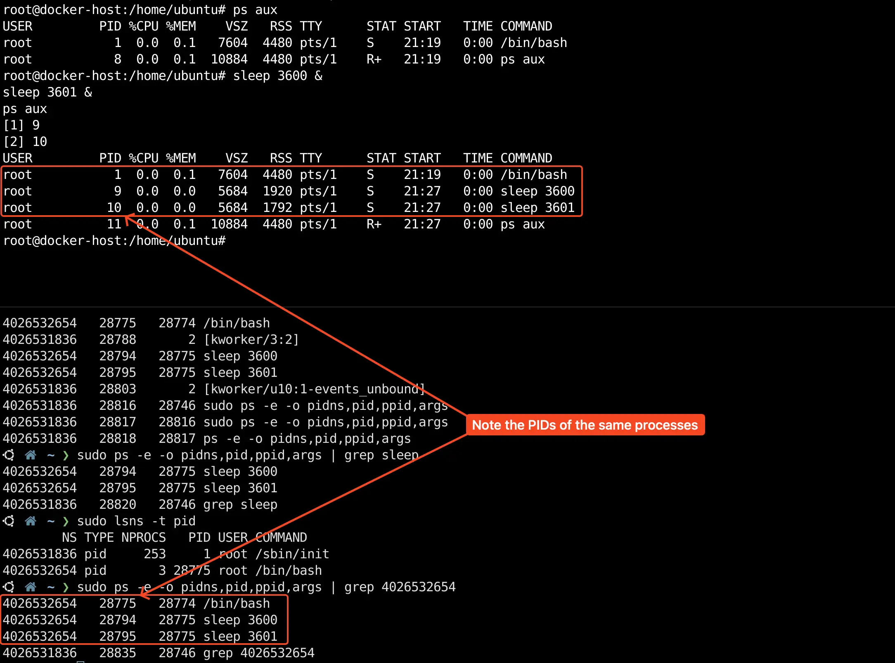

## Container Internals

  


---


### Namespaces

Excerpt from https://blog.kubesimplify.com/understanding-how-containers-work-behind-the-scenes

>When you initialize a container, docker generates a set of namespaces for the container and every container has its own unique set of namespaces.
>
>**There are various types of namespaces with different properties:**
>
>- User/UIDs namespaces - a container running within the user namespace is isolated from the User IDs and Group IDs of other containers, making them unaware of each other's existence.
>- UTS namespaces - isolate hostname and domain name information.
>- IPC namespaces - isolate IPC method.
>- Net namespaces - isolate network interfaces.
>- PID namespaces - isolate process IDs.
>- Mount namespaces - isolate mount points.

`unshare` runs program in new namespaces. Run `man unshare` to learn about `unshare` on Linux.

```
DESCRIPTION
       The unshare command creates new namespaces (as specified by the command-line options described below) and then
       executes the specified program. If program is not given, then "${SHELL}" is run (default: /bin/sh).

       By default, a new namespace persists only as long as it has member processes. A new namespace can be made
       persistent even when it has no member processes by bind mounting /proc/pid/ns/type files to a filesystem path. A
       namespace that has been made persistent in this way can subsequently be entered with nsenter(1) even after the
       program terminates (except PID namespaces where a permanently running init process is required). Once a persistent
       namespace is no longer needed, it can be unpersisted by using umount(8) to remove the bind mount. See the EXAMPLES
       section for more details.
```

[The 7 most used Linux namespaces](https://www.redhat.com/sysadmin/7-linux-namespaces): https://www.redhat.com/sysadmin/7-linux-namespaces

> [!NOTE]
>
> The following demonstrations use `unshare` command to run program in new namespaces. 
>
> [unshare(1) — Linux manual page](https://man7.org/linux/man-pages/man1/unshare.1.html)


#### User/UID namespace on Linux

Excerpt from https://kubernetes.io/docs/concepts/workloads/pods/user-namespaces/

>A user namespace isolates the user running inside the container from the one in the host.
>
>A process running as root in a container can run as a different (non-root) user in the host; in other words, the process has full privileges for operations inside the user namespace, but is unprivileged for operations outside the namespace.

Create a new user `alice` with home directory `/home/alice`. Create a `/home/alice/you-can-see-me` file that only `alice` has `rw` access.

```shell
# These commands run on the host/root user namespace
sudo userdel -r alice
sudo useradd -m alice
sudo touch /home/alice/you-can-see-me
sudo chown alice:alice /home/alice/you-can-see-me
sudo chmod 600 /home/alice/you-can-see-me
sudo ls -l /home/alice/
```

 

This User/UID namespace demonstration is based on https://blog.quarkslab.com/digging-into-linux-namespaces-part-2.html

Impersonate user `alice`, display the `uid` and `gid` of `alice`, and check the ownership of `/home/alice/you-can-see-me` file.

```shell
# These commands run on the host/root user namespace
sudo su alice
```

```shell
# These commands run on the host/root user namespace
cd /home/alice
id
ls -l /home/alice
```

Create a new user namespace:

```shell
# These commands run on the host/root user namespace
unshare -U /bin/bash
```

> [!NOTE]
>
> Starting with Linux 3.8 (and unlike the flags used for creating other types of namespaces), on some Linux distributions, no privilege is required to create a user namespace.

Run `id` command to display the `uid` and `gid` inside the new user namespace,  check the ownership of `/home/alice/you-can-see-me` file again.

```shell
# These commands run inside the new user namespace
id
ls -l /home/alice
```

It appears that the shell running in the new user namespace believes current user is `nobody` and the `/home/alice/you-can-see-me` file is owned by `nobody:nogroup`.

> In the new user namespace our process belongs to user `nobody` with effective UID=65334, which is not present in the system. Okay, but where does it come from and how does the OS resolve it when it comes to system wide operations (modifying files, interacting with programs)? According to the Linux documentation it’s predefined in a file:
>
> If a user ID has no mapping inside the namespace, then system calls that return user IDs return the value defined in the file /proc/sys/kernel/overflowuid, which on a standard system defaults to the value 65534. Initially, a user namespace has no user ID mapping, so all user IDs inside the namespace map to this value.

Start a new SSH session and connect to the same host. Use `lsns` command to show the new user namespace.

```shell
# This command runs on the host/root user namespace
sudo lsns | grep user
```

 

>Some processes need to run under effective UID 0 in order to provide their services and be able to interact with the OS file system. One of the most common things when using user namespaces is to define mappings. This is done using the `/proc/<PID>/uid_map` and `/proc/<PID>/gid_map` files. The format is the following:
>
>ID-inside-ns ID-outside-ns length
>
>*ID-inside-ns (resp.ID-outside-ns)* defines the starting point of UID mapping inside the user namespace (resp. outside of the user namespace) and length defines the number of subsequent UID (resp. GID) mappings. The mappings are applied when a process within a USER namespace tries to manipulate system resources belonging to another USER namespace.

Let's map user `alice` in the root user namespace to user `root` in the new user namespace. From the output of `sudo lsns | grep user` or `ps aux | grep /bin/bash`, the `PID` of `/bin/bash` is 16141.

```shell
# These commands run on the host/root user namespace
sudo lsns | grep user
# Note the PID of alice's /bin/bash process
echo "0 1002 65335" | sudo tee /proc/16141/uid_map
echo "0 1003 65335" | sudo tee /proc/16141/gid_map
```

Go back to the new user namespace, display the `uid` and `gid` of `alice`, and check the ownership of `/home/alice/you-can-see-me` file.

```shell
# These commands run inside the new user namespace
id
ls -l /home/alice
```

It appears that the shell running in the new user namespace believes current user is `root` and the `/home/alice/you-can-see-me` file is owned by `root:root`.

If you create a new file in the new user namespace, it appears the owner of the file is `root:root`.

```shell
# These commands run inside the new user namespace
touch /home/alice/hello-from-inside-uid-ns
ls -l /home/alice
```

When you check the ownership in the root user namespace, the file is owned by `alice:alice` since the user `alice` on the host has been mapped to user `root` in the new user namespace.

```shell
# This command runs on the host/root user namespace
sudo ls -l /home/alice
```

 

> [!NOTE]
>
> The `unshare -U` command has an option `--map-user=uid|name` to run the program only after the current effective user ID has been mapped to uid. `--map-root-user` is equvilent of `--map-user=0`.

Here is an illustration of the above `uid` and `gid` mapping.

 


#### UTS namespace on Linux

Create a UTS namespace:

```shell
sudo unshare --fork --mount --uts /bin/bash
```

Change the hostname inside the namespace.

```shell
# Inside the forked /bin/bash
mount -t tmpfs tmpfs /run
hostname uts-demo
```

> [!NOTE]
>
> [hostname(1) — Linux manual page](https://man7.org/linux/man-pages/man1/hostname.1.html)
>
> [How to configure a hostname on a Linux system](https://www.redhat.com/sysadmin/configure-hostname-linux)

When you run `hostname` command inside the forked `/bin/bash` in its own namespace, it shows the hostname is `uts-demo`.

 

Start a new SSH session and connect to the same host. Use `hostname` command to display the system's hostname. It's still the same.

```shell
# In the new shell of the host
hostname
```

Run `lsns` on the Linux host to list information about all UTS namespaces. Note the `pid` of `unshare --fork --mount --uts /bin/bash`

```shell
# In the new shell of the host
sudo lsns | grep uts
```

Enter the created namespace with `nsenter` command.

> [!NOTE]
>
> [nsenter(1) — Linux manual page](https://man7.org/linux/man-pages/man1/nsenter.1.html)

```shell
# In the new shell of the host
sudo nsenter -t <PID_IN_LSNS_GREP_UTS> -a
```

Show the hostname inside the namespace.

```shell
# Inside the created uts namespace
hostname
```

Exit the namespace and show the hostname again.

```shell
# In the new shell of the host
hostname
```

 


#### Process ID (PID) namespace on Linux

Excerpt from https://man7.org/linux/man-pages/man7/pid_namespaces.7.html

> PID namespaces isolate the process ID number space, meaning that processes in different PID namespaces can have the same PID.
>
> PIDs in a new PID namespace start at 1, somewhat like a standalone system, and calls to fork(2), vfork(2), or clone(2) will produce processes with PIDs that are unique within the namespace.

 

Credit: Nginx blogs

Run `lsns` on the Linux host to list information about all the currently accessible namespaces.

```shell
sudo lsns -t pid
```

If you don't have containers running, this command should list one namespace only.

```
        NS TYPE NPROCS PID USER COMMAND
4026531836 pid     251   1 root /sbin/init
```

Use `unshare` to create a new `PID` namespace:

```shell
sudo unshare --pid --fork --mount-proc /bin/bash
```

Check running process in the new namespace:

```shell
# This command runs in the new namespace
ps aux
```

Start a new SSH session and connect to the same host, run `lsns` on the Linux host to list information about all the currently accessible namespaces.

```shell
sudo lsns -t pid
```

If you don't have containers running, this command should list two namespaces.

```
4026531836 pid     254     1 root /sbin/init
4026532654 pid       1 28775 root /bin/bash
```

 

Create two processes in the new namespace and observer process list:

```
# These commands run in the new namespace
sleep 3600 &
sleep 3601 &
ps aux
```

On the host, show processes with namespace id.

```shell
# These commands run outside of the created namespace
sudo ps -e -o pidns,pid,ppid,args | grep sleep
sudo lsns -t pid
```

 


#### Observe Namespaces of a Running Container

Start a container on the host and start an interactive terminal (enter the shell of the container):

```shell
# This command runs on the host
docker container run -it --rm alpine
```

Create two long running processes and show the processes inside the container.

```shell
# These commands run inside the container
sleep 3600 &
sleep 3601 &
ps aux
```

Find out the namespace id of the container on the host. Show the processes on the host.

```shell
# These commands run on the host
sudo lsns -t pid
sudo ps -e -o pidns,pid,ppid,args | grep NAMESPACE_ID
```

 


#### Net namespaces on Linux

🚧


---


### Control groups (cgroups)

Excerpt from https://www.redhat.com/sysadmin/cgroups-part-one

>Cgroups are, therefore, a facility built into the kernel that allow the administrator to set resource utilization limits on any process on the system. In general, cgroups control:
>
>- The number of CPU shares per process.
>- The limits on memory per process.
>- Block Device I/O per process.
>- Which network packets are identified as the same type so that another application can enforce network traffic rules.

>cgroups are a mechanism for controlling certain subsystems in the kernel. These subsystems, such as devices, CPU, RAM, network access, and so on, are called *controllers* in the cgroup terminology.
>
>Each type of controller (`cpu`, `blkio`, `memory`, etc.) is subdivided into a tree-like structure. Each branch or leaf has its own weights or limits. A control group has multiple processes associated with it, making resource utilization granular and easy to fine-tune.
>
>***NOTE**: Each child inherits and is restricted by the limits set on the parent cgroup.*

 

Credit: https://www.redhat.com/sysadmin/cgroups-part-one

More on `cgroups`: https://www.redhat.com/sysadmin/cgroups-part-two

With the help of `cgroups`, `runc` is able to share available hardware resources with the container and puts a limit on how much resources the container can use.


 

Credit: Nginx blogs

> [!NOTE]
>
> [Managing cgroups with systemd](https://www.redhat.com/sysadmin/cgroups-part-four)

####  `cpu` subsystem of  `cgroups` on Linux

Read more on `cpu` subsystem of  `cgroups`: [Subsystems and Tunable Parameters - cpu](https://docs.redhat.com/en/documentation/Red_Hat_Enterprise_Linux/6/html/Resource_Management_Guide/sec-cpu.html)

Add `cgroup_enable=cpu systemd.unified_cgroup_hierarchy=0` kernel command line options.

> [!NOTE]
>
> This demo runs on Ubuntu Linux 24.04 LTS.
>
> Ubuntu, Debian, RHEL/AlmaLinux/Rocky Linux use `GRUB2`. Arch Linux uses `systemd-boot`.
>
> Read more about kernel's command-line parameters at [The kernel's command-line parameters](https://www.kernel.org/doc/html/latest/admin-guide/kernel-parameters.html)
>
> Read more about `GRUB2` at [Working with GRUB 2](https://docs.redhat.com/en/documentation/red_hat_enterprise_linux/7/html/system_administrators_guide/ch-working_with_the_grub_2_boot_loader) 

Edit `/etc/default/grub`. Add `cgroup_enable=cpu systemd.unified_cgroup_hierarchy=0` to `GRUB_CMDLINE_LINUX`.

```shell
sudo vi /etc/default/grub
```

 

Update the `GRUB` configuration and reboot the system for the changes to take effect.

```shell
sudo update-grub
sudo reboot
```

Install `cgroup-tools` on the host.

```shell
sudo apt install cgroup-tools
```

List available subsystems (resource controllers) for the `cgroups`. Each subsystem has a bunch of tunables to control the resource allocation.

```shell
lssubsys -am
```

```
cpuset
cpu
cpuacct
blkio
memory
devices
freezer
net_cls
perf_event
net_prio
hugetlb
pids
rdma
misc
```

Run `lscgroup` to list all `cgroups`

```shell
lscgroup | grep cpu
```

Focus on `cpu,cpuacct`

```
cpuset:/
cpu,cpuacct:/
cpu,cpuacct:/cpulimit
cpu,cpuacct:/sys-fs-fuse-connections.mount
cpu,cpuacct:/sys-kernel-config.mount
cpu,cpuacct:/sys-kernel-debug.mount
cpu,cpuacct:/dev-mqueue.mount
cpu,cpuacct:/user.slice
cpu,cpuacct:/sys-kernel-tracing.mount
cpu,cpuacct:/init.scope
cpu,cpuacct:/system.slice
cpu,cpuacct:/system.slice/system-systemd\x2dfsck.slice
cpu,cpuacct:/system.slice/open-vm-tools.service
cpu,cpuacct:/system.slice/containerd.service
cpu,cpuacct:/system.slice/systemd-networkd.service
......
```

Create a `cpulimited` `cgroup`.

```shell
sudo cgcreate -g cpu:/cpulimited
ls /sys/fs/cgroup/cpu/cpulimited/
```

 

Install `stress-ng` on the host to stress the CPU (CPU hogs). More on `stress-ng`: https://wiki.ubuntu.com/Kernel/Reference/stress-ng.

```shell
sudo apt install stress-ng
```

Set the `cpu.cfs_quota_us` value of to -1 (unlimited). Run `cgexec` to launch the stress test processes in the manually created  `cpulimited` `cgroup`.

```shell
sudo cgset -r cpu.cfs_quota_us=-1 cpulimited
cgget -r cpu.cfs_quota_us cpulimited
sudo cgexec -g cpu:cpulimited stress-ng --matrix 0 -t 1m
```

Don't stop the stress testing process. Start a new SSH session and connect to the same host, run `htop` to observe CPU utilization.

```shell
htop
```

 

This VM has 4 CPUs and the CPU utilization is 400% for the 4 stress test processes when there is no CPU limit set.

Excerpt from https://docs.redhat.com/en/documentation/Red_Hat_Enterprise_Linux/6/html/Resource_Management_Guide/sec-cpu.html#sect-cfs

>specifies the total amount of time in microseconds (µs, represented here as "*`us`*") for which all tasks in a cgroup can run during one period (as defined by `cpu.cfs_period_us`). As soon as tasks in a cgroup use up all the time specified by the quota, they are throttled for the remainder of the time specified by the period and not allowed to run until the next period. If tasks in a cgroup should be able to access a single CPU for 0.2 seconds out of every 1 second, set `cpu.cfs_quota_us` to `200000` and `cpu.cfs_period_us` to `1000000`. Note that the quota and period parameters operate on a CPU basis. To allow a process to fully utilize two CPUs, for example, set `cpu.cfs_quota_us` to `200000` and `cpu.cfs_period_us` to `100000`.
>
>Setting the value in `cpu.cfs_quota_us` to `-1` indicates that the cgroup does not adhere to any CPU time restrictions. This is also the default value for every cgroup (except the root cgroup).

Set `cpu.cfs_quota_us=200000` to allow a process to fully utilize two CPUs. Run the stress test again.

```shell
sudo cgset -r cpu.cfs_quota_us=200000 cpulimited
cgget -r cpu.cfs_quota_us cpulimited
```

 

Now the CPU utilization is limited to 200%.

Delete the `cpulimited` `cgroup`.

```shell
sudo cgdelete cpu,cpuacct:/cpulimited
```


#### Docker Resource Constraints

Docker (`runc`) uses `cgroups` to put a limit on how much resources a container can use.

https://docs.docker.com/config/containers/resource_constraints/


##### Use `--cpu-shares` 

> Set this flag to a value greater or less than the default of 1024 to increase or reduce the container's weight, and give it access to a greater or lesser proportion of the host machine's CPU cycles. This is only enforced when CPU cycles are constrained. When plenty of CPU cycles are available, all containers use as much CPU as they need. In that way, this is a soft limit.

Run two containers with `--cpus=256` and `--cpus=768`. The `--rm` flag tells the Docker Engine to clean up the container and remove the file system after the container exits.

```shell
# This command runs on the host
docker run --rm --cpu-shares=256 -it alpine
```

Install `stress-ng` inside the container to stress the CPU (CPU hogs). Use `stress-ng` to use all available CPUs for the first container.

```shell
# These commands run inside the first stress testing container
apk add stress-ng
stress-ng --matrix 0 -t 10m
```

Don't stop the stress test inside the container. Start a new SSH session and connect to the same host, start another container with `--cpu-shares=768`.

```shell
# This command runs on the host
docker run --rm --cpu-shares=768 -it alpine
```

Install and use `stress-ng` to use all available CPUs for the second container.

```shell
# These commands run inside the second stress testing container
apk add stress-ng
stress-ng --matrix 0 -t 10m
```

Don't stop the stress testing containers. Start a new SSH session and connect to the same host, use `htop` to observe CPU utilization.

```shell
# This command runs on the host
htop
```

 

The CPU usage of the containers is determined by the `--cpu-shares` argument in the `docker run` command. In this case:

- The first container has a `--cpu-shares` value of 256, which means it can use up to 100% of the available CPU resources.
- The second container has a `--cpu-shares` value of 768, which means it can use up to 300% of the available CPU resources.

The CPU share allocated to each container is proportional to the `--cpu-shares` value specified in the `docker run` command.


##### Use `--cpus=<value>`

`--cpus=<value>` specifies how much of the available CPU resources a container can use.

Run a container without resource constraints.

```shell
# This command runs on the host
docker run --rm -it alpine
```

Use `stress-ng` to use all available CPUs.

```shell
# These commands run inside the container
apk add stress-ng
stress-ng --matrix 0 -t 1m
```

Don't stop the stress test inside the container. Start a new SSH session and connect to the same host, run `htop` to observe CPU utilization.

```shell
# This command runs on the host
htop
```

 

This experiment shows that by default, a container has no resource constraints and can use as much of a given resource as the host's kernel scheduler allows.

Exit the container.

Run a container with resource constraints. `--cpus="0.25"` guarantees the container at most 25% of the CPU every second.

```shell
docker run --cpus="0.25" -it alpine
```

Use `stress-ng` to use all available CPUs.

```shell
# These commands run inside the container
apk add stress-ng
stress-ng --matrix 0 -t 1m
```

Don't stop the stress test inside the container. Start a new SSH session and connect to the same host, run `htop` to observe CPU utilization.

```shell
# This command runs on the host
htop
```

 

For `docker run --cpus="0.25"` on a 4 CPU VM, the `--cpus="0.25"` limits the container to 0.25 CPU (6.25% of 4 CPUs).
