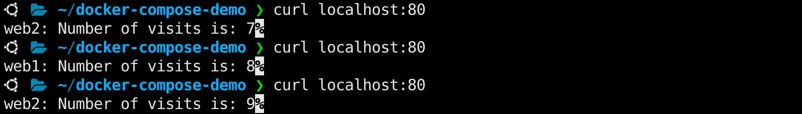

## Docker Compose


### Table of Contents

   * [Docker Compose](#docker-compose)
      * [What is Docker Compose](#what-is-docker-compose)
         * [Docker Compose Overview](#docker-compose-overview)
         * [Why Use Docker Compose](#why-use-docker-compose)
         * [Common Use Cases of Docker Compose](#common-use-cases-of-docker-compose)
            * [Development environments](#development-environments)
            * [Automated Testing Environments](#automated-testing-environments)
            * [Single Host Deployments](#single-host-deployments)
      * [How Compose works](#how-compose-works)
         * [The Compose File](#the-compose-file)
      * [Install Docker Compose](#install-docker-compose)
      * [Docker Compose Demo](#docker-compose-demo)
         * [Project Structure](#project-structure)
         * [compose.yaml](#composeyaml)
         * [Deploy with docker compose](#deploy-with-docker-compose)
         * [Expected Result](#expected-result)
         * [Testing the App](#testing-the-app)
         * [Stop and Remove the Containers](#stop-and-remove-the-containers)
      * [Advanced Docker Compose](#advanced-docker-compose)


---


### What is Docker Compose

#### Docker Compose Overview

Excerpt from [Docker Compose overview | Docker Docs](https://docs.docker.com/compose/)

> Docker Compose is a tool for defining and running multi-container applications. It is the key to unlocking a streamlined and efficient development and deployment experience.
>
> Compose simplifies the control of your entire application stack, making it easy to manage services, networks, and volumes in a single, comprehensible YAML configuration file. Then, with a single command, you create and start all the services from your configuration file.
>
> Compose works in all environments; production, staging, development, testing, as well as CI workflows. It also has commands for managing the whole lifecycle of your application:
>
> - Start, stop, and rebuild services
> - View the status of running services
> - Stream the log output of running services
> - Run a one-off command on a service

#### Why Use Docker Compose

Excerpt from https://docs.docker.com/compose/intro/features-uses/

>Using Docker Compose offers several benefits that streamline the development, deployment, and management of containerized applications:
>
>- Simplified control: Docker Compose allows you to define and manage multi-container applications in a single YAML file. This simplifies the complex task of orchestrating and coordinating various services, making it easier to manage and replicate your application environment.
>- Efficient collaboration: Docker Compose configuration files are easy to share, facilitating collaboration among developers, operations teams, and other stakeholders. This collaborative approach leads to smoother workflows, faster issue resolution, and increased overall efficiency.
>- Rapid application development: Compose caches the configuration used to create a container. When you restart a service that has not changed, Compose re-uses the existing containers. Re-using containers means that you can make changes to your environment very quickly.
>- Portability across environments: Compose supports variables in the Compose file. You can use these variables to customize your composition for different environments, or different users.
>- Extensive community and support: Docker Compose benefits from a vibrant and active community, which means abundant resources, tutorials, and support. This community-driven ecosystem contributes to the continuous improvement of Docker Compose and helps users troubleshoot issues effectively.

#### Common Use Cases of Docker Compose

##### Development environments

>When you're developing software, the ability to run an application in an isolated environment and interact with it is crucial. The Compose command line tool can be used to create the environment and interact with it.
>
>The [Compose file](https://docs.docker.com/compose/compose-file/) provides a way to document and configure all of the application's service dependencies (databases, queues, caches, web service APIs, etc). Using the Compose command line tool you can create and start one or more containers for each dependency with a single command (`docker compose up`).
>
>Together, these features provide a convenient way for you to get started on a project. Compose can reduce a multi-page "developer getting started guide" to a single machine-readable Compose file and a few commands.

##### Automated Testing Environments

> An important part of any Continuous Deployment or Continuous Integration process is the automated test suite. Automated end-to-end testing requires an environment in which to run tests. Compose provides a convenient way to create and destroy isolated testing environments for your test suite. By defining the full environment in a [Compose file](https://docs.docker.com/compose/compose-file/), you can create and destroy these environments in just a few commands:
>
> ```
> docker compose up -d
> ./run_tests
> docker compose down
> ```

##### Single Host Deployments

> Compose has traditionally been focused on development and testing workflows, but with each release we're making progress on more production-oriented features.


---


### How Compose works

Excerpt from https://docs.docker.com/compose/compose-application-model/

>Docker Compose relies on a YAML configuration file, usually named `compose.yaml`.
>
>The `compose.yaml` file follows the rules provided by the [Compose Specification](https://docs.docker.com/compose/compose-file/) in how to define multi-container applications. This is the Docker Compose implementation of the formal [Compose Specification](https://github.com/compose-spec/compose-spec).

#### The Compose File

> The default path for a Compose file is `compose.yaml` (preferred) or `compose.yml` that is placed in the working directory. Compose also supports `docker-compose.yaml` and `docker-compose.yml` for backwards compatibility of earlier versions. If both files exist, Compose prefers the canonical `compose.yaml`.


---


### Install Docker Compose

https://docs.docker.com/compose/install/linux/ 

https://docs.docker.com/compose/install/standalone/


---


### Docker Compose Demo

https://docs.docker.com/compose/gettingstarted/

Download example code from [Sample Node.js application with Nginx proxy and a Redis database.](https://github.com/docker/awesome-compose/tree/master/nginx-nodejs-redis)

#### Project Structure

```
.
├── README.md
├── compose.yaml
├── nginx
│   ├── Dockerfile
│   └── nginx.conf
└── web
    ├── Dockerfile
    ├── package.json
    └── server.js

2 directories, 7 files
```

#### compose.yaml

```
redis:
    image: 'redislabs/redismod'
    ports:
      - '6379:6379'
  web1:
    restart: on-failure
    build: ./web
    hostname: web1
    ports:
      - '81:5000'
  web2:
    restart: on-failure
    build: ./web
    hostname: web2
    ports:
      - '82:5000'
  nginx:
    build: ./nginx
    ports:
    - '80:80'
    depends_on:
    - web1
    - web2
```

The compose file defines an application with four services `redis`, `nginx`, `web1` and `web2`. When deploying the application, docker compose maps port 80 of the nginx service container to port 80 of the host as specified in the file.

Run the following commands to download the project to `~/docker-compose-demo`

```
mkdir -p ~/docker-compose-demo
cd ~/docker-compose-demo

wget https://raw.githubusercontent.com/docker/awesome-compose/master/nginx-nodejs-redis/compose.yaml

mkdir -p nginx web

wget https://raw.githubusercontent.com/docker/awesome-compose/master/nginx-nodejs-redis/nginx/Dockerfile -O nginx/Dockerfile
wget https://raw.githubusercontent.com/docker/awesome-compose/master/nginx-nodejs-redis/nginx/nginx.conf -O nginx/nginx.conf

echo 'node_modules' > web/.gitignore
wget https://raw.githubusercontent.com/docker/awesome-compose/master/nginx-nodejs-redis/web/Dockerfile -O web/Dockerfile
wget https://raw.githubusercontent.com/docker/awesome-compose/master/nginx-nodejs-redis/web/package-lock.json -O web/package-lock.json
wget https://raw.githubusercontent.com/docker/awesome-compose/master/nginx-nodejs-redis/web/package.json -O web/package.json
wget https://raw.githubusercontent.com/docker/awesome-compose/master/nginx-nodejs-redis/web/server.js -O web/server.js
```

#### Deploy with docker compose

`docker compose up` builds, (re)creates, starts, and attaches to containers for a service. `-d` runs containers in the background.

```shell
docker compose up -d
```

The output is similar to this:

```
[+] Running 24/24
 ✔ redis Pulled                                                                                                 28.8s
   ✔ 1fe172e4850f Pull complete                                                                                  3.7s
   ✔ b37ded7c5478 Pull complete                                                                                  3.7s
   ✔ 731f72c7a1a0 Pull complete                                                                                  3.8s
   ✔ 34cfdf5ff0b4 Pull complete                                                                                  3.8s
   ✔ f34dd688846e Pull complete                                                                                  5.1s
   ✔ 6c5b270e591b Pull complete                                                                                  5.1s
   ✔ 85e4511d5c0c Pull complete                                                                                  6.6s
   ✔ 8ae042d0aa02 Pull complete                                                                                  6.6s
   ✔ 8f36acf34341 Pull complete                                                                                  6.6s
   ✔ 4f4fb700ef54 Pull complete                                                                                  7.0s
   ✔ 6de9a4176384 Pull complete                                                                                  7.0s
   ✔ d3e57aaad013 Pull complete                                                                                  7.7s
   ✔ 8eb23391b30a Pull complete                                                                                  9.4s
   ✔ 93afd04540e1 Pull complete                                                                                  9.4s
   ✔ fbab70c08f99 Pull complete                                                                                  9.4s
   ✔ d5a580d6eb66 Pull complete                                                                                 19.0s
   ✔ a78faad883d5 Pull complete                                                                                 19.0s
   ✔ 414b4d29d83b Pull complete                                                                                 19.3s
   ✔ 41b72fc2f30c Pull complete                                                                                 19.3s
   ✔ ae9c2ce92fb1 Pull complete                                                                                 19.4s
   ✔ aeb01ec80daf Pull complete                                                                                 19.4s
   ✔ b90ccc8ea95b Pull complete                                                                                 19.4s
   ✔ 0e6204cd32ab Pull complete                                                                                 27.8s
[+] Building 14.5s (24/27)                                                                             docker:default
 => [web1 internal] load build definition from Dockerfile                                                        0.0s
 => => transferring dockerfile: 182B                                                                             0.0s
 => [web2 internal] load build definition from Dockerfile                                                        0.0s
 => => transferring dockerfile: 182B                                                                             0.0s
 => [web1 internal] load metadata for docker.io/library/node:14.17.3-alpine3.14                                  1.2s
 => [web1 auth] library/node:pull token for registry-1.docker.io                                                 0.0s
 => [web1 internal] load .dockerignore                                                                           0.0s
 => => transferring context: 2B                                                                                  0.0s
 => [web2 internal] load .dockerignore                                                                           0.0s
 => => transferring context: 2B                                                                                  0.0s
 => [web2 1/5] FROM docker.io/library/node:14.17.3-alpine3.14@sha256:2fbaecb39357dec8af7afacaba214bba1ecb1da55b  4.3s
 => => resolve docker.io/library/node:14.17.3-alpine3.14@sha256:2fbaecb39357dec8af7afacaba214bba1ecb1da55ba8163  0.0s
 => => sha256:2fbaecb39357dec8af7afacaba214bba1ecb1da55ba8163f6afe531534787f80 1.22kB / 1.22kB                   0.0s
 => => sha256:289a5e686ccfd79d2cf6e3cded8a5baae90eeb655e46c9c9213ac9dcd67ce3a0 1.16kB / 1.16kB                   0.0s
 => => sha256:4c6ef524cd6d471188cc0f1caea69b7ecca4b8c7f04e731587a0e332929c46ee 6.53kB / 6.53kB                   0.0s
 => => sha256:5843afab387455b37944e709ee8c78d7520df80f8d01cf7f861aae63beeddb6b 2.81MB / 2.81MB                   0.8s
 => => sha256:a37d1565f85984511b93184a508aa421957073350176058f625546b42c2f2513 36.35MB / 36.35MB                 1.5s
 => => sha256:55161235e29f33c7780cd469b11203f5737c26738178dab68aea61e64f89f26b 2.36MB / 2.36MB                   0.6s
 => => sha256:b62f94589dc39388edce717712642533f1734bca9d1c5ffb0f88baa42bb9f9f3 281B / 281B                       0.7s
 => => extracting sha256:5843afab387455b37944e709ee8c78d7520df80f8d01cf7f861aae63beeddb6b                        0.1s
 => => extracting sha256:a37d1565f85984511b93184a508aa421957073350176058f625546b42c2f2513                        2.5s
 => => extracting sha256:55161235e29f33c7780cd469b11203f5737c26738178dab68aea61e64f89f26b                        0.1s
 => => extracting sha256:b62f94589dc39388edce717712642533f1734bca9d1c5ffb0f88baa42bb9f9f3                        0.0s
 => [web1 internal] load build context                                                                           0.0s
 => => transferring context: 16.86kB                                                                             0.0s
 => [web2 internal] load build context                                                                           0.0s
 => => transferring context: 16.86kB                                                                             0.0s
 => [web2 2/5] WORKDIR /usr/src/app                                                                              0.6s
 => [web1 3/5] COPY package.json package-lock.json ./                                                            0.0s
 => [web1 4/5] RUN npm ci                                                                                        2.2s
 => [web1 5/5] COPY ./server.js ./                                                                               0.0s
 => [web1] exporting to image                                                                                    0.1s
 => => exporting layers                                                                                          0.1s
 => => writing image sha256:9d2ff731bf4a4d226813bfa625b24c18af2c4cf07ba29cd067c197aea3c7d0fe                     0.0s
 => => naming to docker.io/library/docker-compose-demo-web1                                                      0.0s
 => [web2] exporting to image                                                                                    0.1s
 => => exporting layers                                                                                          0.1s
 => => writing image sha256:0de7da9e68e34a626c2c8db127387611031dfd4e88ea3b33513ba7325860743f                     0.0s
 => => naming to docker.io/library/docker-compose-demo-web2                                                      0.0s
 => [nginx internal] load build definition from Dockerfile                                                       0.0s
 => => transferring dockerfile: 140B                                                                             0.0s
 => [nginx internal] load metadata for docker.io/library/nginx:1.21.6                                            1.0s
 => [nginx auth] library/nginx:pull token for registry-1.docker.io                                               0.0s
 => [nginx internal] load .dockerignore                                                                          0.0s
 => => transferring context: 2B                                                                                  0.0s
 => [nginx 1/3] FROM docker.io/library/nginx:1.21.6@sha256:2bcabc23b45489fb0885d69a06ba1d648aeda973fae7bb981baf  4.4s
 => => resolve docker.io/library/nginx:1.21.6@sha256:2bcabc23b45489fb0885d69a06ba1d648aeda973fae7bb981bafbb8841  0.0s
 => => sha256:25dedae0aceb6b4fe5837a0acbacc6580453717f126a095aa05a3c6fcea14dd4 1.57kB / 1.57kB                   0.0s
 => => sha256:42c077c10790d51b6f75c4eb895cbd4da37558f7215b39cbf64c46b288f89bda 31.38MB / 31.38MB                 1.3s
 => => sha256:2bcabc23b45489fb0885d69a06ba1d648aeda973fae7bb981bafbb884165e514 1.86kB / 1.86kB                   0.0s
 => => sha256:0e901e68141fd02f237cf63eb842529f8a9500636a9419e3cf4fb986b8fe3d5d 7.66kB / 7.66kB                   0.0s
 => => sha256:62c70f376f6a97b1b1f970100583b01740ee4d0f1305226880d7f1624e425b9b 25.35MB / 25.35MB                 1.7s
 => => sha256:915cc9bd79c2262c322fb536ab56f19e551e71044aa2f80ab964cb15ea5e3ed4 601B / 601B                       0.6s
 => => sha256:75a963e94de04fe56dda9d3e3235bddbb34ea47d8f426acebf260ac24ef91f81 893B / 893B                       0.8s
 => => sha256:7b1fab684d70a138987d1539434eaa1d46f5e1b07cc8ee363cb31d251e048187 667B / 667B                       1.4s
 => => extracting sha256:42c077c10790d51b6f75c4eb895cbd4da37558f7215b39cbf64c46b288f89bda                        2.1s
 => => sha256:db24d06d5af41a56ab5e579ad26c71b7c0e35c6b11fd36015cb5e98df881d025 1.40kB / 1.40kB                   1.5s
 => => extracting sha256:62c70f376f6a97b1b1f970100583b01740ee4d0f1305226880d7f1624e425b9b                        0.8s
 => => extracting sha256:915cc9bd79c2262c322fb536ab56f19e551e71044aa2f80ab964cb15ea5e3ed4                        0.0s
 => => extracting sha256:75a963e94de04fe56dda9d3e3235bddbb34ea47d8f426acebf260ac24ef91f81                        0.0s
 => => extracting sha256:7b1fab684d70a138987d1539434eaa1d46f5e1b07cc8ee363cb31d251e048187                        0.0s
 => => extracting sha256:db24d06d5af41a56ab5e579ad26c71b7c0e35c6b11fd36015cb5e98df881d025                        0.0s
 => [nginx internal] load build context                                                                          0.0s
 => => transferring context: 210B                                                                                0.0s
 => [nginx 2/3] RUN rm /etc/nginx/conf.d/default.conf                                                            0.4s
 => [nginx 3/3] COPY nginx.conf /etc/nginx/conf.d/default.conf                                                   0.0s
 => [nginx] exporting to image                                                                                   0.0s
 => => exporting layers                                                                                          0.0s
 => => writing image sha256:bf47ef3599520cef52438da54458ac1fdebd3ce5f2527dcd90465d337939440f                     0.0s
 => => naming to docker.io/library/docker-compose-demo-nginx                                                     0.0s
[+] Running 5/5
 ✔ Network docker-compose-demo_default    Created                                                                0.1s
 ✔ Container docker-compose-demo-web2-1   Started                                                                0.5s
 ✔ Container docker-compose-demo-redis-1  Started                                                                0.5s
 ✔ Container docker-compose-demo-web1-1   Started                                                                0.5s
 ✔ Container docker-compose-demo-nginx-1  Started                                                                0.9s
```

#### Expected Result

Listing containers must show four containers running and the port mapping as below:

```shell
docker compose ps
```

```
NAME                          IMAGE                       COMMAND                  SERVICE   CREATED              STATUS              PORTS
docker-compose-demo-nginx-1   docker-compose-demo-nginx   "/docker-entrypoint.…"   nginx     About a minute ago   Up About a minute   0.0.0.0:80->80/tcp, :::80->80/tcp
docker-compose-demo-redis-1   redislabs/redismod          "redis-server --load…"   redis     About a minute ago   Up About a minute   0.0.0.0:6379->6379/tcp, :::6379->6379/tcp
docker-compose-demo-web1-1    docker-compose-demo-web1    "docker-entrypoint.s…"   web1      About a minute ago   Up About a minute   0.0.0.0:81->5000/tcp, :::81->5000/tcp
docker-compose-demo-web2-1    docker-compose-demo-web2    "docker-entrypoint.s…"   web2      About a minute ago   Up About a minute   0.0.0.0:82->5000/tcp, :::82->5000/tcp
```

#### Testing the App

After the application starts, run `curl` multiple times to observer visit count and load balancing.

```shell
curl localhost:80
curl localhost:80
curl localhost:80
curl localhost:80
```

 

Or navigate to `http://<IP_ADDRESS_OF_HOST>:80` in your web browser, refresh the web page and check the visit count.

 

#### Stop and Remove the Containers

`docker compose down` stops containers and removes containers, networks, volumes, and images created by `up`.

By default, the only things removed are:

- Containers for services defined in the Compose file.
- Networks defined in the networks section of the Compose file.
- The default network, if one is used.

Networks and volumes defined as external are never removed.

```shell
docker compose down
```

For more Docker Compose examples: [Samples of Docker Compose applications with multiple integrated services](https://github.com/docker/awesome-compose#samples-of-docker-compose-applications-with-multiple-integrated-services)


---


### Advanced Docker Compose

### 🚧