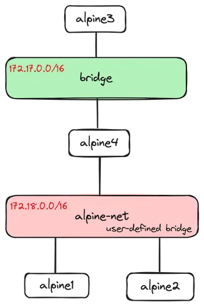

## Docker Networking

Watch this YouTube video: [Docker networking is CRAZY!! (you NEED to learn it) (youtube.com)](https://www.youtube.com/watch?v=bKFMS5C4CG0)

---

### Networking Overview

Excerpt from [Networking overview | Docker Docs](https://docs.docker.com/network/)

>Container networking refers to the ability for containers to connect to and communicate with each other, or to non-Docker workloads.
>
>Containers have networking enabled by default, and they can make outgoing connections. A container has no information about what kind of network it's attached to, or whether their peers are also Docker workloads or not. A container only sees a network interface with an IP address, a gateway, a routing table, DNS services, and other networking details. That is, unless the container uses the `none` network driver.

---

### Default Bridge Network

> This tutorial demonstrates how to use the default `bridge` network that Docker sets up for you automatically. This network is not the best choice for production systems.

Run the demos on [Networking with standalone containers | Docker Docs](https://docs.docker.com/network/network-tutorial-standalone/#use-the-default-bridge-network)

---

### User-defined Bridge Networks

>This tutorial shows how to create and use your own custom bridge networks, to connect containers running on the same Docker host. This is recommended for standalone containers running in production.

Run the demos on [Use user-defined bridge networks | Docker Docs](https://docs.docker.com/network/network-tutorial-standalone/#use-user-defined-bridge-networks)

 

 

Topology of user-defined bridge networks demo.

---

### Host Network

>This tutorial deals with networking standalone containers which bind directly to the Docker host's network, with no network isolation.

Run the demos on [Networking using the host network | Docker Docs](https://docs.docker.com/network/network-tutorial-host/)

