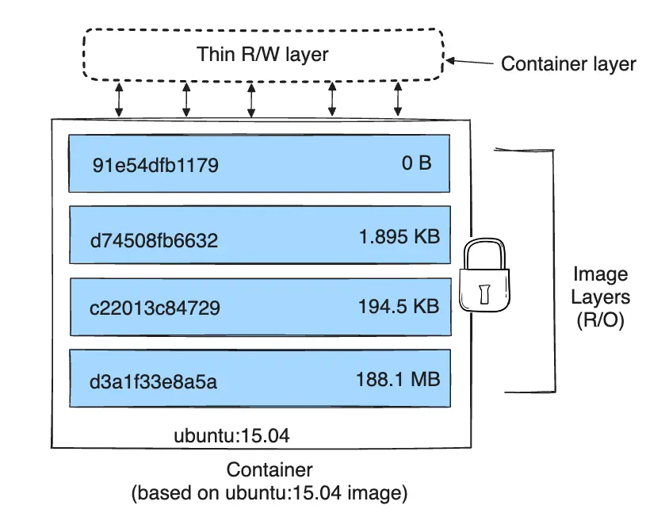

## Docker Storage


### Table of Contents

   * [Docker Storage](#docker-storage)
      * [Introduction](#introduction)
      * [Life Cycle of Read-Write Layers](#life-cycle-of-read-write-layers)
      * [Bind Mounts](#bind-mounts)
      * [Volumes](#volumes)
      * [tmpfs mounts](#tmpfs-mounts)
      * [Storage drivers](#storage-drivers)
   * [Contributing](#contributing)
   * [License](#license)


---


### Introduction

Docker's storage system is engineered for portability, efficiency, and performance, and is fine-tuned to store, retrieve, and transfer images across various environments. When a container is removed, all data written to that container is also deleted.

Containers are inherently ephemeral. For running stateful workloads like databases, email servers or content management systems, it is crucial to detach the stateful data (such as DB configuration files and data folders) from the containers. Stateful data should be independent of the container's lifecycle.


---


### Life Cycle of Read-Write Layers

Read [OverlayFS](https://github.com/sait-lab/container-basics?tab=readme-ov-file#overlayfs) and [Deep Dive into Docker Internals - Union Filesystem](https://martinheinz.dev/blog/44)

Excerpt from [Persisting container data | Docker Docs](https://docs.docker.com/guides/docker-concepts/running-containers/persisting-container-data/)

> When a container starts, it uses the files and configuration provided by the image. Each container is able to create, modify, and delete files and does so without affecting any other containers. When the container is deleted, these file changes are also deleted.
>
> While this ephemeral nature of containers is great, it poses a challenge when you want to persist the data.

 

Let's run a container and create a `/file1.txt` file inside it.

```shell
# This command runs on the host
docker run --name demo-container -it alpine

# This command runs inside the container
# Create a /file1.txt in the container's filesystem
echo 'hello docker' > /file1.txt
```

Inspect the `GraphDrive` on the host:

```shell
# This command runs on the host
sudo docker inspect demo-container | jq ".[0].GraphDriver.Data"
```

It shows the OverlayFS info similar to this:
```
{
  "LowerDir": "/var/lib/docker/overlay2/273a0b6d8bed4e54075ecd6a8900fa0c6e0e540192f4c2fdae543396a3d414fc-init/diff:/var/lib/docker/overlay2/57fa1fcc173785f74e12fd4e7d81254e052055f164d595ae3a24d7dc4af69a00/diff",
  "MergedDir": "/var/lib/docker/overlay2/273a0b6d8bed4e54075ecd6a8900fa0c6e0e540192f4c2fdae543396a3d414fc/merged",
  "UpperDir": "/var/lib/docker/overlay2/273a0b6d8bed4e54075ecd6a8900fa0c6e0e540192f4c2fdae543396a3d414fc/diff",
  "WorkDir": "/var/lib/docker/overlay2/273a0b6d8bed4e54075ecd6a8900fa0c6e0e540192f4c2fdae543396a3d414fc/work"
}
```

`UpperDir` is the read-write layer where changes are written. The `/file1.txt` file created inside the container can be located at `UpperDir`.  

If you modify files in `UpperDir` on the host, the running container will immediately detect these changes.

 

When a container is removed, the files in the read-write layer is removed with the container.

```
# These commands run on the host
docker rm demo-container

sudo ls /var/lib/docker/overlay2/
```

The `LowerDir`, `MergedDir`, `UpperDir`, and `WorkDir` directories cease to exist on the host.


---


### Bind Mounts

Expert from https://docs.docker.com/storage/bind-mounts/

> Bind mounts have been around since the early days of Docker. Bind mounts have limited functionality compared to [volumes](https://docs.docker.com/storage/volumes/). When you use a bind mount, a file or directory on the host machine is mounted into a container. The file or directory is referenced by its absolute path on the host machine. By contrast, when you use a volume, a new directory is created within Docker's storage directory on the host machine, and Docker manages that directory's contents.
>
> The file or directory does not need to exist on the Docker host already. It is created on demand if it does not yet exist. Bind mounts are very performant, but they rely on the host machine's filesystem having a specific directory structure available. If you are developing new Docker applications, consider using [named volumes](https://docs.docker.com/storage/volumes/) instead. You can't use Docker CLI commands to directly manage bind mounts.

 

Consider a case when you have a directory `~/logs` on the host and you want to save a `nginx` container's log to it.

```
# These commands run on the host
mkdir -p ~/logs && cd ~/logs

docker run -itd -p 8000:80 --name web-server-1 -v "$(pwd)":/var/log/nginx/ nginx:latest
```

The `docker run` command runs a nginx container in background and print container ID. It maps container's port 80 to port 8000 on the host. the `-v` argument bind mounts the `~/logs` directory to container's `/var/log/nginx/`.

If you run `curl http://127.0.0.1:8000` on the host to access the `nginx` web server, the logs will be saved to `~/logs` directory on the host.

 

In general, you should use volumes where possible. Bind mounts are appropriate for the following types of use case:

- Sharing configuration files from the host machine to containers. This is how Docker provides DNS resolution to containers by default, by mounting `/etc/resolv.conf` from the host machine into each container.

- Sharing source code or build artifacts between a development environment on the Docker host and a container. For instance, you may mount a Maven `target/` directory into a container, and each time you build the Maven project on the Docker host, the container gets access to the rebuilt artifacts.

  If you use Docker for development this way, your production Dockerfile would copy the production-ready artifacts directly into the image, rather than relying on a bind mount.

- When the file or directory structure of the Docker host is guaranteed to be consistent with the bind mounts the containers require.


---


### Volumes

Read [Container volumes](https://github.com/sait-lab/container-basics?tab=readme-ov-file#container-volumes) for the volume management commands.

`docker volume create <VOLUME_NAME>` command creates a directory by default at `/var/lib/docker/volumes` on the host.

 

`docker volume inspect <VOLUME_NAME>` command shows mount point of the volume on the host.

```
# This command runs on the host
docker volume inspect web_content

[
    {
        "CreatedAt": "2024-07-03T23:57:30-06:00",
        "Driver": "local",
        "Labels": null,
        "Mountpoint": "/var/lib/docker/volumes/web_content/_data",
        "Name": "web_content",
        "Options": null,
        "Scope": "local"
    }
]
```

Populate the volume with an `index.html` file:

```
# This command runs on the host
echo 'hello docker volume' | sudo tee /var/lib/docker/volumes/web_content/_data/index.html > /dev/null

sudo cat /var/lib/docker/volumes/web_content/_data/index.html
```

This volume can be shared across multiple containers running on the same host. Let's create two containers and mount the same volume.

```
# These commands run on the host
docker run --name container-1 -v web_content:/var/www -itd alpine
docker run --name container-2 -v web_content:/var/www -itd alpine

# Show the content of /var/www/index.html on both containers
docker exec -it container-1 cat /var/www/index.html
docker exec -it container-2 cat /var/www/index.html
```

 

This is particularly useful when multiple containers running on the same host require read-write access to a shared directory. For instance, containers operating a web server behind a load balancer can deliver the same content and save logs to the same directory, simplifying data management and analysis.

The `web_content` volume still persists on the host after removal of all containers mounted with this volume. It's decoupled from the lifecycle of the container.

 

If you need to share volumes among containers running on different hosts, shared filesystems like Ceph, GlusterFS,  and Network File System (NFS) can be used to set up a distributed filesystem across each host that runs Docker containers. By having a consistent naming convention and a unified namespace, all containers can access the durable storage backend, regardless of the host they are deployed from.

Volumes are the preferred way to persist data in Docker containers and services. Some use cases for volumes include:

- Sharing data among multiple running containers. If you don't explicitly create it, a volume is created the first time it is mounted into a container. When that container stops or is removed, the volume still exists. Multiple containers can mount the same volume simultaneously, either read-write or read-only. Volumes are only removed when you explicitly remove them.
- When the Docker host is not guaranteed to have a given directory or file structure. Volumes help you decouple the configuration of the Docker host from the container runtime.
- When you want to store your container's data on a remote host or a cloud provider, rather than locally.
- When you need to back up, restore, or migrate data from one Docker host to another, volumes are a better choice. You can stop containers using the volume, then back up the volume's directory (such as `/var/lib/docker/volumes/<volume-name>`).


---


### tmpfs mounts

Excerpt from https://docs.docker.com/storage/tmpfs/

>[Volumes](https://docs.docker.com/storage/volumes/) and [bind mounts](https://docs.docker.com/storage/bind-mounts/) let you share files between the host machine and container so that you can persist data even after the container is stopped.
>
>If you're running Docker on Linux, you have a third option: `tmpfs` mounts. When you create a container with a `tmpfs` mount, the container can create files outside the container's writable layer.
>
>As opposed to volumes and bind mounts, a `tmpfs` mount is temporary, and only persisted in the host memory. When the container stops, the `tmpfs` mount is removed, and files written there won't be persisted.

`tmpfs` mounts are best used for cases when you do not want the data to persist either on the host machine or within the container. This may be for security reasons or to protect the performance of the container when your application needs to write a large volume of non-persistent state data.


---


### Storage drivers

Excerpt from https://docs.docker.com/storage/storagedriver/

>Docker uses storage drivers to store image layers, and to store data in the writable layer of a container. The container's writable layer doesn't persist after the container is deleted, but is suitable for storing ephemeral data that is generated at runtime. Storage drivers are optimized for space efficiency, but (depending on the storage driver) write speeds are lower than native file system performance, especially for storage drivers that use a copy-on-write filesystem. Write-intensive applications, such as database storage, are impacted by a performance overhead, particularly if pre-existing data exists in the read-only layer.
>
>Use Docker volumes for write-intensive data, data that must persist beyond the container's lifespan, and data that must be shared between containers.

Read [Images and layers](https://docs.docker.com/storage/storagedriver/#images-and-layers)

Excerpt from https://docs.docker.com/storage/storagedriver/select-storage-driver/

> Docker supports several storage drivers, using a pluggable architecture. The storage driver controls how images and containers are stored and managed on your Docker host.
>
> The Docker Engine provides the following storage drivers on Linux:
>
> | Driver            | Description                                                  |
> | :---------------- | :----------------------------------------------------------- |
> | `overlay2`        | `overlay2` is the preferred storage driver for all currently supported Linux distributions, and requires no extra configuration. |
> | `fuse-overlayfs`  | `fuse-overlayfs`is preferred only for running Rootless Docker on a host that does not provide support for rootless `overlay2`. On Ubuntu and Debian 10, the `fuse-overlayfs` driver does not need to be used, and `overlay2` works even in rootless mode. Refer to the [rootless mode documentation](https://docs.docker.com/engine/security/rootless/) for details. |
> | `btrfs` and `zfs` | The `btrfs` and `zfs` storage drivers allow for advanced options, such as creating "snapshots", but require more maintenance and setup. Each of these relies on the backing filesystem being configured correctly. |
> | `vfs`             | The `vfs` storage driver is intended for testing purposes, and for situations where no copy-on-write filesystem can be used. Performance of this storage driver is poor, and is not generally recommended for production use. |

>Your operating system and kernel may not support every storage driver. For example, `btrfs` is only supported if your system uses `btrfs` as storage. In general, the following configurations work on recent versions of the Linux distribution:

| Linux distribution | Recommended storage drivers | Alternative drivers |
| :----------------- | :-------------------------- | :------------------ |
| Ubuntu             | `overlay2`                  | `zfs`, `vfs`        |
| Debian             | `overlay2`                  | `vfs`               |
| CentOS             | `overlay2`                  | `zfs`, `vfs`        |
| Fedora             | `overlay2`                  | `zfs`, `vfs`        |
| SLES 15            | `overlay2`                  | `vfs`               |
| RHEL               | `overlay2`                  | `vfs`               |

> When in doubt, the best all-around configuration is to **use a modern Linux distribution with a kernel that supports the `overlay2` storage driver**, and to **use Docker volumes** for write-heavy workloads instead of relying on writing data to the container's writable layer.

